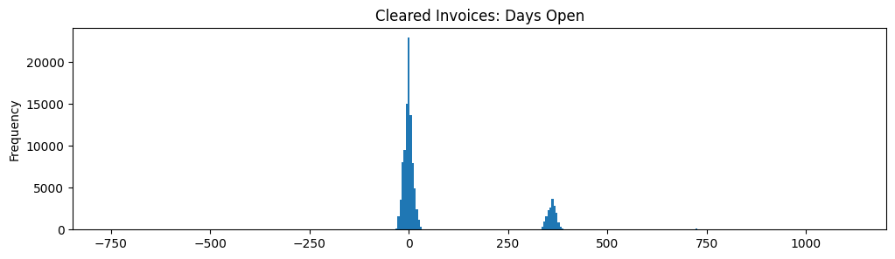
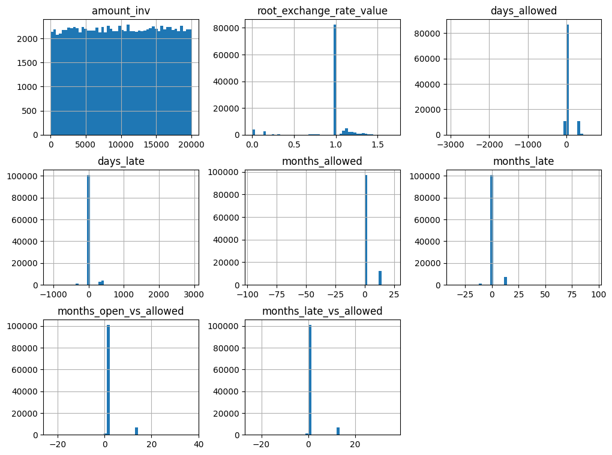
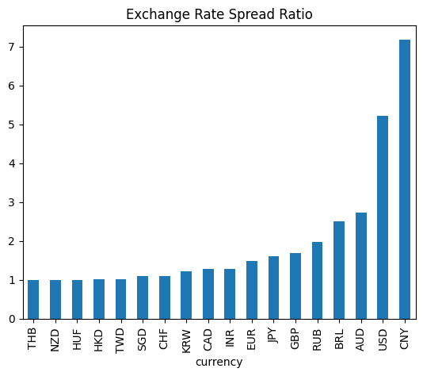
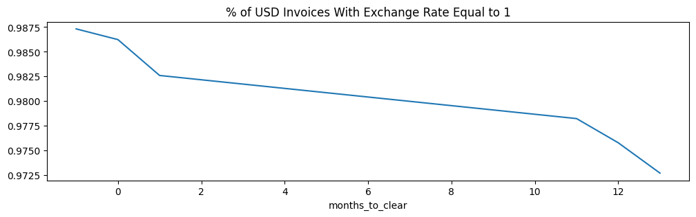

```python
%matplotlib inline
```
# Input Datasets  


```python
import pandas
data_folder = '../data'
date_format='%Y-%M-%d' #truncate datetimes to dates
invoices = pandas.read_csv(data_folder + '/invoice.csv', na_values='inf', 
                           parse_dates=['invoice_date', 'due_date', 'cleared_date'], date_format=date_format)
payments = pandas.read_csv(data_folder + '/invoice_payments.csv', na_values='inf',
                           parse_dates=['transaction_date'], date_format=date_format)
```
## Dataset Definitions & Relationships

We have two input datasets: invoices and their payments.
- Payments are amounts in time, which are directly mapped to companies. 
- Invoices can have multiple payments, but usually only have 1. 


```python
invoices.dtypes
```


    id                                   int64
    due_date                    datetime64[ns]
    invoice_date                datetime64[ns]
    status                              object
    amount_inv                         float64
    currency                            object
    company_id                           int64
    customer_id                          int64
    account_id                           int64
    cleared_date                datetime64[ns]
    root_exchange_rate_value           float64
    dtype: object


```python
payments.dtypes
```


    amount                             float64
    root_exchange_rate_value           float64
    transaction_date            datetime64[ns]
    invoice_id                           int64
    company_id                           int64
    converted_amount                   float64
    dtype: object


```python
#The join key will be invoice_id, so it must be unique (and it is).
invoices.id.value_counts(dropna=False).value_counts(dropna=False)\
.to_frame(name="ids").rename_axis('invoices_per_id')
```


<div>
<style scoped>
    .dataframe tbody tr th:only-of-type {
        vertical-align: middle;
    }

    .dataframe tbody tr th {
        vertical-align: top;
    }

    .dataframe thead th {
        text-align: right;
    }
</style>
<table border="1" class="dataframe">
  <thead>
    <tr style="text-align: right;">
      <th></th>
      <th>ids</th>
    </tr>
    <tr>
      <th>invoices_per_id</th>
      <th></th>
    </tr>
  </thead>
  <tbody>
    <tr>
      <th>1</th>
      <td>113085</td>
    </tr>
  </tbody>
</table>
</div>


```python
payments.invoice_id.value_counts(dropna=False).value_counts(dropna=False)\
.to_frame(name="invoices").rename_axis('payments_per_invoice')
```


<div>
<style scoped>
    .dataframe tbody tr th:only-of-type {
        vertical-align: middle;
    }

    .dataframe tbody tr th {
        vertical-align: top;
    }

    .dataframe thead th {
        text-align: right;
    }
</style>
<table border="1" class="dataframe">
  <thead>
    <tr style="text-align: right;">
      <th></th>
      <th>invoices</th>
    </tr>
    <tr>
      <th>payments_per_invoice</th>
      <th></th>
    </tr>
  </thead>
  <tbody>
    <tr>
      <th>1</th>
      <td>98920</td>
    </tr>
    <tr>
      <th>2</th>
      <td>5751</td>
    </tr>
    <tr>
      <th>3</th>
      <td>268</td>
    </tr>
    <tr>
      <th>4</th>
      <td>59</td>
    </tr>
    <tr>
      <th>5</th>
      <td>15</td>
    </tr>
    <tr>
      <th>6</th>
      <td>8</td>
    </tr>
    <tr>
      <th>14</th>
      <td>1</td>
    </tr>
    <tr>
      <th>9</th>
      <td>1</td>
    </tr>
    <tr>
      <th>8</th>
      <td>1</td>
    </tr>
    <tr>
      <th>7</th>
      <td>1</td>
    </tr>
  </tbody>
</table>
</div>


### Transforming Dates to Quantities


```python
invoice_time_allowed = invoices.due_date - invoices.invoice_date
invoice_time_open = invoices.cleared_date - invoices.invoice_date
invoice_time_late = invoice_time_open - invoice_time_allowed
```

```python
invoices['days_allowed'] = invoice_time_allowed.map(lambda t: t.days if not pandas.isnull(t) else None)
invoices['days_open'] = invoice_time_open.map(lambda t: t.days if not pandas.isnull(t) else None)
invoices['days_late'] = invoice_time_late.map(lambda t: t.days if not pandas.isnull(t) else None)

invoices['months_allowed'] = (invoices.due_date.dt.to_period('M') - invoices.invoice_date.dt.to_period('M'))
invoices.months_allowed = invoices.months_allowed.map(lambda m: m.n if not pandas.isnull(m) else None)
invoices['months_open'] = (invoices.cleared_date.dt.to_period('M') - invoices.invoice_date.dt.to_period('M'))
invoices.months_open = invoices.months_open.map(lambda m: m.n if not pandas.isnull(m) else None)
invoices['months_late'] = (invoices.cleared_date.dt.to_period('M') - invoices.due_date.dt.to_period('M'))
invoices.months_late = invoices.months_late.map(lambda m: m.n if not pandas.isnull(m) else None)
```
## Entity Definitions & Relationships

- Company: business entity for which Tesorio is forecasting cash collected. There are only two. Each company collects using multiple currencies from multiple customers. 
- Account: **In this limited dataset, accounts and companies are synonymous, so we ignore accounts.**  
- Customer: metadata about an invoice which is specific to each company. 


```python
invoices.groupby("company_id")[["customer_id","currency"]].nunique()
```


<div>
<style scoped>
    .dataframe tbody tr th:only-of-type {
        vertical-align: middle;
    }

    .dataframe tbody tr th {
        vertical-align: top;
    }

    .dataframe thead th {
        text-align: right;
    }
</style>
<table border="1" class="dataframe">
  <thead>
    <tr style="text-align: right;">
      <th></th>
      <th>customer_id</th>
      <th>currency</th>
    </tr>
    <tr>
      <th>company_id</th>
      <th></th>
      <th></th>
    </tr>
  </thead>
  <tbody>
    <tr>
      <th>14</th>
      <td>546</td>
      <td>13</td>
    </tr>
    <tr>
      <th>114</th>
      <td>4509</td>
      <td>15</td>
    </tr>
  </tbody>
</table>
</div>


```python
invoices.groupby("customer_id").company_id.nunique().value_counts()\
.to_frame(name='customers').rename_axis('companies_per_customer')
```


<div>
<style scoped>
    .dataframe tbody tr th:only-of-type {
        vertical-align: middle;
    }

    .dataframe tbody tr th {
        vertical-align: top;
    }

    .dataframe thead th {
        text-align: right;
    }
</style>
<table border="1" class="dataframe">
  <thead>
    <tr style="text-align: right;">
      <th></th>
      <th>customers</th>
    </tr>
    <tr>
      <th>companies_per_customer</th>
      <th></th>
    </tr>
  </thead>
  <tbody>
    <tr>
      <th>1</th>
      <td>5055</td>
    </tr>
  </tbody>
</table>
</div>


```python
invoices.groupby("company_id").account_id.nunique().to_frame(name="unique_accounts")
```


<div>
<style scoped>
    .dataframe tbody tr th:only-of-type {
        vertical-align: middle;
    }

    .dataframe tbody tr th {
        vertical-align: top;
    }

    .dataframe thead th {
        text-align: right;
    }
</style>
<table border="1" class="dataframe">
  <thead>
    <tr style="text-align: right;">
      <th></th>
      <th>unique_accounts</th>
    </tr>
    <tr>
      <th>company_id</th>
      <th></th>
    </tr>
  </thead>
  <tbody>
    <tr>
      <th>14</th>
      <td>1</td>
    </tr>
    <tr>
      <th>114</th>
      <td>1</td>
    </tr>
  </tbody>
</table>
</div>


```python
invoices.groupby("account_id").company_id.nunique().value_counts()\
.to_frame(name='count').rename_axis('companies_per_account')
```


<div>
<style scoped>
    .dataframe tbody tr th:only-of-type {
        vertical-align: middle;
    }

    .dataframe tbody tr th {
        vertical-align: top;
    }

    .dataframe thead th {
        text-align: right;
    }
</style>
<table border="1" class="dataframe">
  <thead>
    <tr style="text-align: right;">
      <th></th>
      <th>count</th>
    </tr>
    <tr>
      <th>companies_per_account</th>
      <th></th>
    </tr>
  </thead>
  <tbody>
    <tr>
      <th>1</th>
      <td>2</td>
    </tr>
  </tbody>
</table>
</div>


## Data Cleaning Needs

### Payments

Transaction data begins in 2011 and ends on 2021-01-31. 


```python
payments.__len__()
```


    111623


```python
payment_stats = payments.describe(include='all')
payment_stats.loc['% populated'] = payment_stats.loc['count']/payments.__len__()
payment_stats
```


<div>
<style scoped>
    .dataframe tbody tr th:only-of-type {
        vertical-align: middle;
    }

    .dataframe tbody tr th {
        vertical-align: top;
    }

    .dataframe thead th {
        text-align: right;
    }
</style>
<table border="1" class="dataframe">
  <thead>
    <tr style="text-align: right;">
      <th></th>
      <th>amount</th>
      <th>root_exchange_rate_value</th>
      <th>transaction_date</th>
      <th>invoice_id</th>
      <th>company_id</th>
      <th>converted_amount</th>
    </tr>
  </thead>
  <tbody>
    <tr>
      <th>count</th>
      <td>111622.000000</td>
      <td>111623.000000</td>
      <td>111623</td>
      <td>111623.000000</td>
      <td>111623.000000</td>
      <td>1.116220e+05</td>
    </tr>
    <tr>
      <th>mean</th>
      <td>9416.980646</td>
      <td>0.968372</td>
      <td>2017-09-21 16:48:01.513129216</td>
      <td>56528.677575</td>
      <td>110.865341</td>
      <td>9.128716e+03</td>
    </tr>
    <tr>
      <th>min</th>
      <td>0.000004</td>
      <td>0.000806</td>
      <td>2011-01-01 00:05:00</td>
      <td>0.000000</td>
      <td>14.000000</td>
      <td>1.800562e-08</td>
    </tr>
    <tr>
      <th>25%</th>
      <td>4078.626249</td>
      <td>1.000000</td>
      <td>2016-01-18 00:07:00</td>
      <td>28303.000000</td>
      <td>114.000000</td>
      <td>3.180972e+03</td>
    </tr>
    <tr>
      <th>50%</th>
      <td>9332.665539</td>
      <td>1.000000</td>
      <td>2018-01-20 00:02:00</td>
      <td>56476.000000</td>
      <td>114.000000</td>
      <td>8.819620e+03</td>
    </tr>
    <tr>
      <th>75%</th>
      <td>14651.495863</td>
      <td>1.000000</td>
      <td>2020-01-05 00:02:00</td>
      <td>84775.500000</td>
      <td>114.000000</td>
      <td>1.461286e+04</td>
    </tr>
    <tr>
      <th>max</th>
      <td>19999.879159</td>
      <td>3.253307</td>
      <td>2021-01-31 00:03:00</td>
      <td>113084.000000</td>
      <td>114.000000</td>
      <td>6.120943e+04</td>
    </tr>
    <tr>
      <th>std</th>
      <td>6015.336178</td>
      <td>0.244600</td>
      <td>NaN</td>
      <td>32634.233788</td>
      <td>17.425341</td>
      <td>6.438813e+03</td>
    </tr>
    <tr>
      <th>% populated</th>
      <td>0.999991</td>
      <td>1.000000</td>
      <td>1.0</td>
      <td>1.000000</td>
      <td>1.000000</td>
      <td>9.999910e-01</td>
    </tr>
  </tbody>
</table>
</div>


```python
#converted_amount is reliable
(((payments.amount * payments.root_exchange_rate_value) - payments.converted_amount).abs()).max()
```


    1.0913936421275139e-11


```python
payments.select_dtypes(include='float').hist(bins=50, figsize=(12, 3), layout=(1,3))
```


    array([[<Axes: title={'center': 'amount'}>,
            <Axes: title={'center': 'root_exchange_rate_value'}>,
            <Axes: title={'center': 'converted_amount'}>]], dtype=object)


### Invoices


```python
invoices_stats = invoices.describe(include='all')
invoices_stats.loc['% populated'] = invoices_stats.loc['count']/invoices.__len__()
invoices_stats
```


<div>
<style scoped>
    .dataframe tbody tr th:only-of-type {
        vertical-align: middle;
    }

    .dataframe tbody tr th {
        vertical-align: top;
    }

    .dataframe thead th {
        text-align: right;
    }
</style>
<table border="1" class="dataframe">
  <thead>
    <tr style="text-align: right;">
      <th></th>
      <th>id</th>
      <th>due_date</th>
      <th>invoice_date</th>
      <th>status</th>
      <th>amount_inv</th>
      <th>currency</th>
      <th>company_id</th>
      <th>customer_id</th>
      <th>account_id</th>
      <th>cleared_date</th>
      <th>root_exchange_rate_value</th>
      <th>days_allowed</th>
      <th>days_open</th>
      <th>days_late</th>
      <th>months_open</th>
      <th>months_allowed</th>
      <th>months_late</th>
    </tr>
  </thead>
  <tbody>
    <tr>
      <th>count</th>
      <td>113085.000000</td>
      <td>113060</td>
      <td>113085</td>
      <td>113085</td>
      <td>113085.000000</td>
      <td>113085</td>
      <td>113085.000000</td>
      <td>113085.000000</td>
      <td>113085.000000</td>
      <td>113085</td>
      <td>113085.000000</td>
      <td>113060.000000</td>
      <td>113085.000000</td>
      <td>113060.000000</td>
      <td>113085.000000</td>
      <td>113060.000000</td>
      <td>113060.000000</td>
    </tr>
    <tr>
      <th>unique</th>
      <td>NaN</td>
      <td>NaN</td>
      <td>NaN</td>
      <td>2</td>
      <td>NaN</td>
      <td>18</td>
      <td>NaN</td>
      <td>NaN</td>
      <td>NaN</td>
      <td>NaN</td>
      <td>NaN</td>
      <td>NaN</td>
      <td>NaN</td>
      <td>NaN</td>
      <td>NaN</td>
      <td>NaN</td>
      <td>NaN</td>
    </tr>
    <tr>
      <th>top</th>
      <td>NaN</td>
      <td>NaN</td>
      <td>NaN</td>
      <td>CLEARED</td>
      <td>NaN</td>
      <td>USD</td>
      <td>NaN</td>
      <td>NaN</td>
      <td>NaN</td>
      <td>NaN</td>
      <td>NaN</td>
      <td>NaN</td>
      <td>NaN</td>
      <td>NaN</td>
      <td>NaN</td>
      <td>NaN</td>
      <td>NaN</td>
    </tr>
    <tr>
      <th>freq</th>
      <td>NaN</td>
      <td>NaN</td>
      <td>NaN</td>
      <td>109382</td>
      <td>NaN</td>
      <td>85146</td>
      <td>NaN</td>
      <td>NaN</td>
      <td>NaN</td>
      <td>NaN</td>
      <td>NaN</td>
      <td>NaN</td>
      <td>NaN</td>
      <td>NaN</td>
      <td>NaN</td>
      <td>NaN</td>
      <td>NaN</td>
    </tr>
    <tr>
      <th>mean</th>
      <td>56542.000000</td>
      <td>2017-10-18 01:21:46.726340096</td>
      <td>2017-09-09 19:59:16.684971776</td>
      <td>NaN</td>
      <td>10026.599910</td>
      <td>NaN</td>
      <td>111.135783</td>
      <td>751.424778</td>
      <td>0.028642</td>
      <td>2017-11-18 00:39:17.928637952</td>
      <td>0.970822</td>
      <td>38.019591</td>
      <td>69.009975</td>
      <td>30.890324</td>
      <td>2.338241</td>
      <td>1.275358</td>
      <td>1.062869</td>
    </tr>
    <tr>
      <th>min</th>
      <td>0.000000</td>
      <td>2010-01-07 00:09:00</td>
      <td>2010-01-21 00:12:00</td>
      <td>NaN</td>
      <td>0.027581</td>
      <td>NaN</td>
      <td>14.000000</td>
      <td>0.000000</td>
      <td>0.000000</td>
      <td>2011-01-01 00:05:00</td>
      <td>0.000815</td>
      <td>-2931.000000</td>
      <td>-753.000000</td>
      <td>-1085.000000</td>
      <td>-24.000000</td>
      <td>-96.000000</td>
      <td>-36.000000</td>
    </tr>
    <tr>
      <th>25%</th>
      <td>28271.000000</td>
      <td>2016-01-20 00:05:00</td>
      <td>2016-01-18 00:08:00</td>
      <td>NaN</td>
      <td>5030.122601</td>
      <td>NaN</td>
      <td>114.000000</td>
      <td>129.000000</td>
      <td>0.000000</td>
      <td>2016-01-21 00:08:00</td>
      <td>1.000000</td>
      <td>-1.000000</td>
      <td>-5.000000</td>
      <td>-6.000000</td>
      <td>0.000000</td>
      <td>0.000000</td>
      <td>0.000000</td>
    </tr>
    <tr>
      <th>50%</th>
      <td>56542.000000</td>
      <td>2018-01-22 00:04:00</td>
      <td>2018-01-20 00:05:00</td>
      <td>NaN</td>
      <td>10018.092660</td>
      <td>NaN</td>
      <td>114.000000</td>
      <td>411.000000</td>
      <td>0.000000</td>
      <td>2018-01-24 00:04:00</td>
      <td>1.000000</td>
      <td>0.000000</td>
      <td>1.000000</td>
      <td>0.000000</td>
      <td>0.000000</td>
      <td>0.000000</td>
      <td>0.000000</td>
    </tr>
    <tr>
      <th>75%</th>
      <td>84813.000000</td>
      <td>2020-01-11 00:07:00</td>
      <td>2020-01-08 00:12:00</td>
      <td>NaN</td>
      <td>15029.685611</td>
      <td>NaN</td>
      <td>114.000000</td>
      <td>995.000000</td>
      <td>0.000000</td>
      <td>2020-01-10 00:05:00</td>
      <td>1.000000</td>
      <td>1.000000</td>
      <td>15.000000</td>
      <td>8.000000</td>
      <td>0.000000</td>
      <td>0.000000</td>
      <td>0.000000</td>
    </tr>
    <tr>
      <th>max</th>
      <td>113084.000000</td>
      <td>2023-01-31 00:01:00</td>
      <td>2023-01-01 00:01:00</td>
      <td>NaN</td>
      <td>19999.974875</td>
      <td>NaN</td>
      <td>114.000000</td>
      <td>5054.000000</td>
      <td>1.000000</td>
      <td>2022-01-01 00:01:00</td>
      <td>1.681560</td>
      <td>731.000000</td>
      <td>1110.000000</td>
      <td>2922.000000</td>
      <td>36.000000</td>
      <td>24.000000</td>
      <td>96.000000</td>
    </tr>
    <tr>
      <th>std</th>
      <td>32644.971933</td>
      <td>NaN</td>
      <td>NaN</td>
      <td>NaN</td>
      <td>5767.833365</td>
      <td>NaN</td>
      <td>16.679941</td>
      <td>906.575543</td>
      <td>0.166799</td>
      <td>NaN</td>
      <td>0.246109</td>
      <td>112.451179</td>
      <td>147.657290</td>
      <td>118.213037</td>
      <td>4.902367</td>
      <td>3.716912</td>
      <td>3.942094</td>
    </tr>
    <tr>
      <th>% populated</th>
      <td>1.000000</td>
      <td>0.999779</td>
      <td>1.0</td>
      <td>1.0</td>
      <td>1.000000</td>
      <td>1.0</td>
      <td>1.000000</td>
      <td>1.000000</td>
      <td>1.000000</td>
      <td>1.0</td>
      <td>1.000000</td>
      <td>0.999779</td>
      <td>1.000000</td>
      <td>0.999779</td>
      <td>1.000000</td>
      <td>0.999779</td>
      <td>0.999779</td>
    </tr>
  </tbody>
</table>
</div>


```python
#opened outside of payment data time period
(invoices.loc[invoices.invoice_date>payments.transaction_date.max()].__len__(), 
invoices.loc[invoices.invoice_date<payments.transaction_date.min()].__len__())
```


    (15, 1)


### Cleared vs Open 

- Open invoices still have a date cleared


```python
invoices.status.value_counts(normalize=True, dropna=False).to_frame(name="% of Invoices")
```


<div>
<style scoped>
    .dataframe tbody tr th:only-of-type {
        vertical-align: middle;
    }

    .dataframe tbody tr th {
        vertical-align: top;
    }

    .dataframe thead th {
        text-align: right;
    }
</style>
<table border="1" class="dataframe">
  <thead>
    <tr style="text-align: right;">
      <th></th>
      <th>% of Invoices</th>
    </tr>
    <tr>
      <th>status</th>
      <th></th>
    </tr>
  </thead>
  <tbody>
    <tr>
      <th>CLEARED</th>
      <td>0.967255</td>
    </tr>
    <tr>
      <th>OPEN</th>
      <td>0.032745</td>
    </tr>
  </tbody>
</table>
</div>


```python
invoices.loc[invoices.status == 'OPEN'].cleared_date.value_counts(dropna=False)
```


    cleared_date
    2022-01-01 00:01:00    3703
    Name: count, dtype: int64


```python
invoices.loc[invoices.cleared_date.isnull() != (invoices.status == 'OPEN'),['status','cleared_date']]\
.value_counts(dropna=False)
```


    status  cleared_date       
    OPEN    2022-01-01 00:01:00    3703
    Name: count, dtype: int64


### Date Relationships for Cleared Invoices


```python
cleared_invoices = invoices.query("status=='CLEARED'").drop(columns=['status'])
```

```python
#invoices are either cleared around the normal billing cycle or a year later
cleared_invoices.days_open.plot(kind='hist',bins=365, title="Cleared Invoices: Days Open", figsize=(12, 3))
```


    <Axes: title={'center': 'Cleared Invoices: Days Open'}, ylabel='Frequency'>





```python
cleared_invoices.__len__()/invoices.__len__()
```


    0.9672547199009595


```python
#invoices are either open only in the month they became active or a year later
cleared_invoices.months_open.value_counts(normalize=True, dropna=False)
```


    months_open
     0     0.833227
     12    0.163180
     24    0.002112
    -12    0.001124
     36    0.000265
    -24    0.000091
    Name: proportion, dtype: float64


```python
#invoices are either due the same month they became active or a year later
cleared_invoices.months_allowed.value_counts(normalize=True, dropna=False)
```


    months_allowed
     0.0     0.890101
     12.0    0.109579
     NaN     0.000229
    -12.0    0.000055
     24.0    0.000018
    -48.0    0.000009
    -96.0    0.000009
    Name: proportion, dtype: float64


```python
cleared_invoices.months_late.value_counts(normalize=True, dropna=False)
```


    months_late
     0.0     0.922986
     12.0    0.064243
    -12.0    0.010587
     24.0    0.001582
     36.0    0.000238
     NaN     0.000229
    -24.0    0.000110
     48.0    0.000009
    -36.0    0.000009
     96.0    0.000009
    Name: proportion, dtype: float64


```python
cleared_invoices['months_late_vs_allowed'] = cleared_invoices.months_late/(cleared_invoices.months_allowed+1)
cleared_invoices.months_late_vs_allowed.value_counts(normalize=True, dropna=False)
```


    months_late_vs_allowed
     0.000000     0.922986
     12.000000    0.063639
    -0.923077     0.009481
     24.000000    0.001545
    -12.000000    0.001097
     0.923077     0.000558
     36.000000    0.000238
     NaN          0.000229
    -24.000000    0.000082
    -1.090909     0.000046
     1.846154     0.000027
    -1.846154     0.000027
    -0.480000     0.000009
    -1.021277     0.000009
    -2.769231     0.000009
    -2.181818     0.000009
    -1.010526     0.000009
    Name: proportion, dtype: float64


```python
cleared_invoices.select_dtypes(include=['float']).hist(bins=50, figsize=(12, 9))
```


    array([[<Axes: title={'center': 'amount_inv'}>,
            <Axes: title={'center': 'root_exchange_rate_value'}>,
            <Axes: title={'center': 'days_allowed'}>],
           [<Axes: title={'center': 'days_late'}>,
            <Axes: title={'center': 'months_allowed'}>,
            <Axes: title={'center': 'months_late'}>],
           [<Axes: title={'center': 'months_open_vs_allowed'}>,
            <Axes: title={'center': 'months_late_vs_allowed'}>, <Axes: >]],
          dtype=object)





### Exchange Rate

Exchange rates change for both payments and open invoices. Customers would expect to pay the amount they were originally invoiced in their own currency, not the USD amount originally invoiced. Therefore, we should use raw amounts to determine how much is paid vs due. 


```python
# USD is not is always 1 - it varies a lot
currency_ranges = cleared_invoices.groupby("currency").root_exchange_rate_value.describe(percentiles=[])
(currency_ranges['max']/currency_ranges['min']).sort_values().plot(kind='bar', title="Exchange Rate Spread Ratio")
```


    <Axes: title={'center': 'Exchange Rate Spread Ratio'}, xlabel='currency'>





```python
# a significant % of cleared USD invoices have an exchange rate unequal to 1
cleared_invoices_usd = cleared_invoices\
.query("currency=='USD' and months_allowed>=0 and months_allowed<=12 and months_late<=12").copy()
cleared_invoices_usd['exchange_rate_is_1'] = cleared_invoices_usd['root_exchange_rate_value'] == 1
cleared_invoices_usd.exchange_rate_is_1.mean()
```


    0.9845438613572194


```python
# USD exchange rate variations from 1 tend to be invoices which took longer to clear
# This suggests that the invoice exchange rate is "current state data." 
time_to_clear = cleared_invoices_usd.cleared_date - cleared_invoices_usd.invoice_date
cleared_invoices_usd['months_to_clear'] = time_to_clear.map(lambda t: round(t.days/30))
cleared_invoices_usd.months_to_clear.value_counts(normalize=True, dropna=False)
```


    months_to_clear
     0     0.712358
     12    0.127020
    -1     0.083877
     1     0.051030
     13    0.012219
     11    0.011732
    -12    0.001010
    -13    0.000365
     24    0.000170
     25    0.000073
    -24    0.000061
    -11    0.000037
    -25    0.000037
     23    0.000012
    Name: proportion, dtype: float64


```python
cleared_invoices_usd.groupby("exchange_rate_is_1").months_to_clear.agg(['mean','count'])
```


<div>
<style scoped>
    .dataframe tbody tr th:only-of-type {
        vertical-align: middle;
    }

    .dataframe tbody tr th {
        vertical-align: top;
    }

    .dataframe thead th {
        text-align: right;
    }
</style>
<table border="1" class="dataframe">
  <thead>
    <tr style="text-align: right;">
      <th></th>
      <th>mean</th>
      <th>count</th>
    </tr>
    <tr>
      <th>exchange_rate_is_1</th>
      <th></th>
      <th></th>
    </tr>
  </thead>
  <tbody>
    <tr>
      <th>False</th>
      <td>2.855118</td>
      <td>1270</td>
    </tr>
    <tr>
      <th>True</th>
      <td>1.748745</td>
      <td>80898</td>
    </tr>
  </tbody>
</table>
</div>


```python
cleared_invoices_usd.groupby(cleared_invoices_usd.months_to_clear.clip(upper=13, lower=-1))\
.exchange_rate_is_1.mean().plot(title='% of USD Invoices With Exchange Rate Equal to 1', figsize=(12,3))
```


    <Axes: title={'center': '% of USD Invoices With Exchange Rate Equal to 1'}, xlabel='months_to_clear'>





```python

```
### Merge

- 18% of payments are partial. 
- Exchange rates vary across payments.
- Companies are consistent between payments and invoices, when payments are present


```python
#all payment invoices are represented in both datasets 
len(set(payments.invoice_id) - set(invoices.id))
```


    0


```python
#7% of invoices do not have payments yet
len(set(invoices.id) - set(payments.invoice_id))/invoices.__len__()
```


    0.07127382057744175


```python
invoice_payments = invoices.rename(columns={"id":"invoice_id","amount_inv":"amount"})\
.merge(payments, on="invoice_id", how='left', suffixes=('_inv', '_pmt'))
```

```python
duplicated_columns = [col.replace('_pmt','') for col in invoice_payments.columns if col.endswith('_pmt')]
for col in  duplicated_columns:
    inconsistent_rows = invoice_payments.loc[invoice_payments[col + '_pmt']!=invoice_payments[col + '_inv']]
    print(f"{col}: {inconsistent_rows.__len__()/invoice_payments.__len__()} inconsistent rows in merged dataset")
```
    amount: 0.1829583148818128 inconsistent rows in merged dataset
    root_exchange_rate_value: 0.30690240050800865 inconsistent rows in merged dataset
    company_id: 0.06734456856863548 inconsistent rows in merged dataset


```python
invoice_payments.query("company_id_pmt!=company_id_inv").company_id_pmt.value_counts()
```


    Series([], Name: count, dtype: int64)


## Adding Analytical Variables 

### Date Quantity Variables

#### Broken Down By Period

What period-level should we use? (day, week, month)
Create periods from invoice date to close date
Rolling payment window: due_date - current period
Rolling days open: cleared_date - current period 

# Metadata Calculations & Cleaning

Totals, Uniques, Averages, Ranges, Outliers, Missings
Variables: Invoices, USD Amounts, Cleared/Open, Due Date, Invoice Date, Transaction Date, Customers, Companies, Accounts

# Notes

## Notable entities

e.g. customers with notable values

## Sparsity

### Entities

### Date Periods

## Trends Over Time

# Analysis

## Business Motivation

Cash collections don't follow due dates

## Data Science Benchmark

Define & Quantify: customers' mean absolute % error each period from cash due.

## Data Science Target

Best outcome variable? 
Days late
Days open (Total and Rolling)
Days Open as a % of Payment Window (Total and Rolling)
Days Late as a % of Payment Window (Total and Rolling)