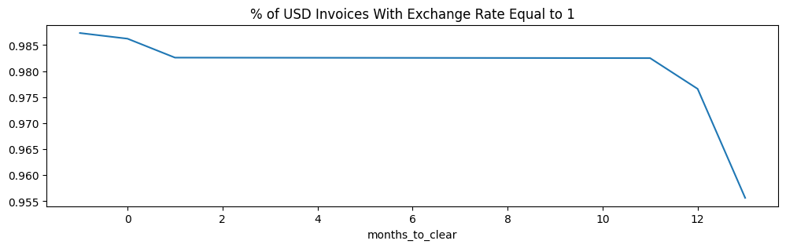

```python
%matplotlib inline
```
# Input Datasets  


```python
import pandas
data_folder = '../data'
date_format='%Y-%M-%d' #truncate datetimes to dates
invoices = pandas.read_csv(data_folder + '/invoice.csv', na_values='inf', 
                           parse_dates=['invoice_date', 'due_date', 'cleared_date'], date_format=date_format)
payments = pandas.read_csv(data_folder + '/invoice_payments.csv', na_values='inf',
                           parse_dates=['transaction_date'], date_format=date_format)
```
## Dataset Definitions & Relationships

We have two input datasets: invoices and their payments.
- Payments are amounts in time, which are directly mapped to companies. 
- Invoices can have multiple payments, but usually only have 1. 


```python
invoices.dtypes
```


    id                                   int64
    due_date                    datetime64[ns]
    invoice_date                datetime64[ns]
    status                              object
    amount_inv                         float64
    currency                            object
    company_id                           int64
    customer_id                          int64
    account_id                           int64
    cleared_date                datetime64[ns]
    root_exchange_rate_value           float64
    dtype: object


```python
payments.dtypes
```


    amount                             float64
    root_exchange_rate_value           float64
    transaction_date            datetime64[ns]
    invoice_id                           int64
    company_id                           int64
    converted_amount                   float64
    dtype: object


```python
#The join key will be invoice_id, so it must be unique (and it is).
invoices.id.value_counts(dropna=False).value_counts(dropna=False)\
.to_frame(name="ids").rename_axis('invoices_per_id')
```


<div>
<style scoped>
    .dataframe tbody tr th:only-of-type {
        vertical-align: middle;
    }

    .dataframe tbody tr th {
        vertical-align: top;
    }

    .dataframe thead th {
        text-align: right;
    }
</style>
<table border="1" class="dataframe">
  <thead>
    <tr style="text-align: right;">
      <th></th>
      <th>ids</th>
    </tr>
    <tr>
      <th>invoices_per_id</th>
      <th></th>
    </tr>
  </thead>
  <tbody>
    <tr>
      <th>1</th>
      <td>113085</td>
    </tr>
  </tbody>
</table>
</div>


```python
#all payments are represented in both datasets 
len(set(payments.invoice_id) - set(invoices.id))
```


    0


```python
#7% of invoices do not have payments yet
len(set(invoices.id) - set(payments.invoice_id))/invoices.__len__()
```


    0.07127382057744175


```python
#invoices usually have one payment but may have more
payments.invoice_id.value_counts(dropna=False).value_counts(dropna=False, normalize=True)\
.to_frame(name="invoices").rename_axis('payments_per_invoice')
```


<div>
<style scoped>
    .dataframe tbody tr th:only-of-type {
        vertical-align: middle;
    }

    .dataframe tbody tr th {
        vertical-align: top;
    }

    .dataframe thead th {
        text-align: right;
    }
</style>
<table border="1" class="dataframe">
  <thead>
    <tr style="text-align: right;">
      <th></th>
      <th>invoices</th>
    </tr>
    <tr>
      <th>payments_per_invoice</th>
      <th></th>
    </tr>
  </thead>
  <tbody>
    <tr>
      <th>1</th>
      <td>0.941871</td>
    </tr>
    <tr>
      <th>2</th>
      <td>0.054758</td>
    </tr>
    <tr>
      <th>3</th>
      <td>0.002552</td>
    </tr>
    <tr>
      <th>4</th>
      <td>0.000562</td>
    </tr>
    <tr>
      <th>5</th>
      <td>0.000143</td>
    </tr>
    <tr>
      <th>6</th>
      <td>0.000076</td>
    </tr>
    <tr>
      <th>14</th>
      <td>0.000010</td>
    </tr>
    <tr>
      <th>9</th>
      <td>0.000010</td>
    </tr>
    <tr>
      <th>8</th>
      <td>0.000010</td>
    </tr>
    <tr>
      <th>7</th>
      <td>0.000010</td>
    </tr>
  </tbody>
</table>
</div>


## Entity Definitions & Relationships

- Company: business entity for which Tesorio is forecasting cash collected. There are only two. Each company collects using multiple currencies from multiple customers. 
- Account: **In this limited dataset, accounts and companies are synonymous, so we ignore accounts.**  
- Customer: metadata about an invoice which is specific to each company. 


```python
invoices.groupby("company_id")[["customer_id","currency"]].nunique()
```


<div>
<style scoped>
    .dataframe tbody tr th:only-of-type {
        vertical-align: middle;
    }

    .dataframe tbody tr th {
        vertical-align: top;
    }

    .dataframe thead th {
        text-align: right;
    }
</style>
<table border="1" class="dataframe">
  <thead>
    <tr style="text-align: right;">
      <th></th>
      <th>customer_id</th>
      <th>currency</th>
    </tr>
    <tr>
      <th>company_id</th>
      <th></th>
      <th></th>
    </tr>
  </thead>
  <tbody>
    <tr>
      <th>14</th>
      <td>546</td>
      <td>13</td>
    </tr>
    <tr>
      <th>114</th>
      <td>4509</td>
      <td>15</td>
    </tr>
  </tbody>
</table>
</div>


```python
invoices.groupby("customer_id").company_id.nunique().value_counts()\
.to_frame(name='customers').rename_axis('companies_per_customer')
```


<div>
<style scoped>
    .dataframe tbody tr th:only-of-type {
        vertical-align: middle;
    }

    .dataframe tbody tr th {
        vertical-align: top;
    }

    .dataframe thead th {
        text-align: right;
    }
</style>
<table border="1" class="dataframe">
  <thead>
    <tr style="text-align: right;">
      <th></th>
      <th>customers</th>
    </tr>
    <tr>
      <th>companies_per_customer</th>
      <th></th>
    </tr>
  </thead>
  <tbody>
    <tr>
      <th>1</th>
      <td>5055</td>
    </tr>
  </tbody>
</table>
</div>


```python
invoices.groupby("company_id").account_id.nunique().to_frame(name="unique_accounts")
```


<div>
<style scoped>
    .dataframe tbody tr th:only-of-type {
        vertical-align: middle;
    }

    .dataframe tbody tr th {
        vertical-align: top;
    }

    .dataframe thead th {
        text-align: right;
    }
</style>
<table border="1" class="dataframe">
  <thead>
    <tr style="text-align: right;">
      <th></th>
      <th>unique_accounts</th>
    </tr>
    <tr>
      <th>company_id</th>
      <th></th>
    </tr>
  </thead>
  <tbody>
    <tr>
      <th>14</th>
      <td>1</td>
    </tr>
    <tr>
      <th>114</th>
      <td>1</td>
    </tr>
  </tbody>
</table>
</div>


```python
invoices.groupby("account_id").company_id.nunique().value_counts()\
.to_frame(name='count').rename_axis('companies_per_account')
```


<div>
<style scoped>
    .dataframe tbody tr th:only-of-type {
        vertical-align: middle;
    }

    .dataframe tbody tr th {
        vertical-align: top;
    }

    .dataframe thead th {
        text-align: right;
    }
</style>
<table border="1" class="dataframe">
  <thead>
    <tr style="text-align: right;">
      <th></th>
      <th>count</th>
    </tr>
    <tr>
      <th>companies_per_account</th>
      <th></th>
    </tr>
  </thead>
  <tbody>
    <tr>
      <th>1</th>
      <td>2</td>
    </tr>
  </tbody>
</table>
</div>


## Data Cleaning Needs

### Payments

Transaction data begins in 2011 and ends on 2021-01-31. We will assume this is when the data was pulled. 


```python
payments.__len__()
```


    111623


```python
payment_stats = payments.describe(exclude='int')
payment_stats.loc['% populated'] = payment_stats.loc['count']/payments.__len__()
payment_stats
```


<div>
<style scoped>
    .dataframe tbody tr th:only-of-type {
        vertical-align: middle;
    }

    .dataframe tbody tr th {
        vertical-align: top;
    }

    .dataframe thead th {
        text-align: right;
    }
</style>
<table border="1" class="dataframe">
  <thead>
    <tr style="text-align: right;">
      <th></th>
      <th>amount</th>
      <th>root_exchange_rate_value</th>
      <th>transaction_date</th>
      <th>converted_amount</th>
    </tr>
  </thead>
  <tbody>
    <tr>
      <th>count</th>
      <td>111622.000000</td>
      <td>111623.000000</td>
      <td>111623</td>
      <td>1.116220e+05</td>
    </tr>
    <tr>
      <th>mean</th>
      <td>9416.980646</td>
      <td>0.968372</td>
      <td>2017-09-21 16:48:01.513129216</td>
      <td>9.128716e+03</td>
    </tr>
    <tr>
      <th>min</th>
      <td>0.000004</td>
      <td>0.000806</td>
      <td>2011-01-01 00:05:00</td>
      <td>1.800562e-08</td>
    </tr>
    <tr>
      <th>25%</th>
      <td>4078.626249</td>
      <td>1.000000</td>
      <td>2016-01-18 00:07:00</td>
      <td>3.180972e+03</td>
    </tr>
    <tr>
      <th>50%</th>
      <td>9332.665539</td>
      <td>1.000000</td>
      <td>2018-01-20 00:02:00</td>
      <td>8.819620e+03</td>
    </tr>
    <tr>
      <th>75%</th>
      <td>14651.495863</td>
      <td>1.000000</td>
      <td>2020-01-05 00:02:00</td>
      <td>1.461286e+04</td>
    </tr>
    <tr>
      <th>max</th>
      <td>19999.879159</td>
      <td>3.253307</td>
      <td>2021-01-31 00:03:00</td>
      <td>6.120943e+04</td>
    </tr>
    <tr>
      <th>std</th>
      <td>6015.336178</td>
      <td>0.244600</td>
      <td>NaN</td>
      <td>6.438813e+03</td>
    </tr>
    <tr>
      <th>% populated</th>
      <td>0.999991</td>
      <td>1.000000</td>
      <td>1.0</td>
      <td>9.999910e-01</td>
    </tr>
  </tbody>
</table>
</div>


```python
last_transaction_date = payments.transaction_date.max()
first_transaction_date = payments.transaction_date.min()
first_transaction_date, last_transaction_date
```


    (Timestamp('2011-01-01 00:05:00'), Timestamp('2021-01-31 00:03:00'))


```python
#converted_amount is reliable
(((payments.amount * payments.root_exchange_rate_value) - payments.converted_amount).abs()).max()
```


    1.0913936421275139e-11


```python
payments[payments.amount.isnull()!=payments.converted_amount.isnull()].__len__()
```


    0


```python
payments.select_dtypes(include='float').hist(bins=50, figsize=(12, 3), layout=(1,3))
```


    array([[<Axes: title={'center': 'amount'}>,
            <Axes: title={'center': 'root_exchange_rate_value'}>,
            <Axes: title={'center': 'converted_amount'}>]], dtype=object)


### Invoices


```python
#opened outside of payment data time period or after they were due - need to filter 
(invoices.loc[invoices.invoice_date>last_transaction_date].__len__(), 
invoices.loc[invoices.invoice_date<first_transaction_date].__len__(), 
invoices.loc[invoices.invoice_date.dt.to_period('M')>invoices.due_date.dt.to_period('M')].__len__())
```


    (15, 1, 8)


```python
invoices = invoices.loc[(invoices.invoice_date>=first_transaction_date) &
                        (invoices.invoice_date<=last_transaction_date) & 
                        (invoices.invoice_date.dt.to_period('M')<=invoices.due_date.dt.to_period('M'))]
```

```python
#to compare to payments. Are we holding the customer accountable to USD or their own currency?
invoices['converted_amount'] = invoices.amount_inv * invoices.root_exchange_rate_value
```

```python
invoices_stats = invoices.describe(exclude='int')
invoices_stats.loc['% populated'] = invoices_stats.loc['count']/invoices.__len__()
invoices_stats
```


<div>
<style scoped>
    .dataframe tbody tr th:only-of-type {
        vertical-align: middle;
    }

    .dataframe tbody tr th {
        vertical-align: top;
    }

    .dataframe thead th {
        text-align: right;
    }
</style>
<table border="1" class="dataframe">
  <thead>
    <tr style="text-align: right;">
      <th></th>
      <th>due_date</th>
      <th>invoice_date</th>
      <th>status</th>
      <th>amount_inv</th>
      <th>currency</th>
      <th>cleared_date</th>
      <th>root_exchange_rate_value</th>
      <th>converted_amount</th>
    </tr>
  </thead>
  <tbody>
    <tr>
      <th>count</th>
      <td>113036</td>
      <td>113036</td>
      <td>113036</td>
      <td>113036.000000</td>
      <td>113036</td>
      <td>113036</td>
      <td>113036.000000</td>
      <td>113036.000000</td>
    </tr>
    <tr>
      <th>unique</th>
      <td>NaN</td>
      <td>NaN</td>
      <td>2</td>
      <td>NaN</td>
      <td>18</td>
      <td>NaN</td>
      <td>NaN</td>
      <td>NaN</td>
    </tr>
    <tr>
      <th>top</th>
      <td>NaN</td>
      <td>NaN</td>
      <td>CLEARED</td>
      <td>NaN</td>
      <td>USD</td>
      <td>NaN</td>
      <td>NaN</td>
      <td>NaN</td>
    </tr>
    <tr>
      <th>freq</th>
      <td>NaN</td>
      <td>NaN</td>
      <td>109348</td>
      <td>NaN</td>
      <td>85108</td>
      <td>NaN</td>
      <td>NaN</td>
      <td>NaN</td>
    </tr>
    <tr>
      <th>mean</th>
      <td>2017-10-17 22:28:07.196645632</td>
      <td>2017-09-09 17:55:30.649704448</td>
      <td>NaN</td>
      <td>10026.752277</td>
      <td>NaN</td>
      <td>2017-11-17 22:46:37.326692352</td>
      <td>0.970802</td>
      <td>9742.174421</td>
    </tr>
    <tr>
      <th>min</th>
      <td>2011-01-01 00:05:00</td>
      <td>2011-01-01 00:05:00</td>
      <td>NaN</td>
      <td>0.027581</td>
      <td>NaN</td>
      <td>2011-01-01 00:05:00</td>
      <td>0.000815</td>
      <td>0.007976</td>
    </tr>
    <tr>
      <th>25%</th>
      <td>2016-01-20 00:05:00</td>
      <td>2016-01-18 00:08:00</td>
      <td>NaN</td>
      <td>5030.646720</td>
      <td>NaN</td>
      <td>2016-01-21 00:08:00</td>
      <td>1.000000</td>
      <td>4161.228596</td>
    </tr>
    <tr>
      <th>50%</th>
      <td>2018-01-22 00:04:00</td>
      <td>2018-01-20 00:05:00</td>
      <td>NaN</td>
      <td>10017.743195</td>
      <td>NaN</td>
      <td>2018-01-24 00:04:00</td>
      <td>1.000000</td>
      <td>9587.389379</td>
    </tr>
    <tr>
      <th>75%</th>
      <td>2020-01-11 00:07:00</td>
      <td>2020-01-08 00:11:00</td>
      <td>NaN</td>
      <td>15030.595146</td>
      <td>NaN</td>
      <td>2020-01-10 00:05:00</td>
      <td>1.000000</td>
      <td>15058.319044</td>
    </tr>
    <tr>
      <th>max</th>
      <td>2022-01-15 00:01:00</td>
      <td>2021-01-31 00:03:00</td>
      <td>NaN</td>
      <td>19999.974875</td>
      <td>NaN</td>
      <td>2022-01-01 00:01:00</td>
      <td>1.681560</td>
      <td>32285.475685</td>
    </tr>
    <tr>
      <th>std</th>
      <td>NaN</td>
      <td>NaN</td>
      <td>NaN</td>
      <td>5767.870567</td>
      <td>NaN</td>
      <td>NaN</td>
      <td>0.246155</td>
      <td>6286.335744</td>
    </tr>
    <tr>
      <th>% populated</th>
      <td>1.0</td>
      <td>1.0</td>
      <td>1.0</td>
      <td>1.000000</td>
      <td>1.0</td>
      <td>1.0</td>
      <td>1.000000</td>
      <td>1.000000</td>
    </tr>
  </tbody>
</table>
</div>


```python
invoices['months_allowed'] = invoices.due_date.dt.to_period('M') - invoices.invoice_date.dt.to_period('M')
invoices.months_allowed = invoices.months_allowed.map(lambda m: m.n if not pandas.isnull(m) else None)
#almost all invoices are due immediately or in 1 year. should filter out the rest
invoices.months_allowed.value_counts(normalize=True, dropna=False)
```


    months_allowed
    0     0.893556
    12    0.106426
    24    0.000018
    Name: proportion, dtype: float64


### Exchange Rate

Exchange rates vary for both payments and open invoices. Customers would expect to pay the amount they were originally invoiced in their own currency, not the USD amount originally invoiced. Therefore, we should use raw amounts to determine how much is paid vs due. 


```python
# USD is not is always 1 - it varies a lot
currency_ranges = invoices.groupby("currency").root_exchange_rate_value.describe(percentiles=[])
(currency_ranges['max']/currency_ranges['min']).sort_values().plot(kind='bar', title="Exchange Rate Spread Ratio")
```


    <Axes: title={'center': 'Exchange Rate Spread Ratio'}, xlabel='currency'>


```python
# 1.6% of USD invoices have an exchange rate unequal to 1
invoices_usd = invoices.query("currency=='USD'").copy()
invoices_usd['exchange_rate_is_1'] = invoices_usd['root_exchange_rate_value'] == 1
1 - invoices_usd.exchange_rate_is_1.mean()
```


    0.015756450627438023


```python
# USD exchange rate variations from 1 tend to be invoices which took longer to clear
# This suggests that the invoice exchange rate is "current state data." 
time_to_clear = invoices_usd.cleared_date - invoices_usd.invoice_date
invoices_usd['months_to_clear'] = time_to_clear.map(lambda t: round(t.days/30))
```

```python
invoices_usd.groupby("exchange_rate_is_1").months_to_clear.agg(['mean','count'])
```


<div>
<style scoped>
    .dataframe tbody tr th:only-of-type {
        vertical-align: middle;
    }

    .dataframe tbody tr th {
        vertical-align: top;
    }

    .dataframe thead th {
        text-align: right;
    }
</style>
<table border="1" class="dataframe">
  <thead>
    <tr style="text-align: right;">
      <th></th>
      <th>mean</th>
      <th>count</th>
    </tr>
    <tr>
      <th>exchange_rate_is_1</th>
      <th></th>
      <th></th>
    </tr>
  </thead>
  <tbody>
    <tr>
      <th>False</th>
      <td>3.553318</td>
      <td>1341</td>
    </tr>
    <tr>
      <th>True</th>
      <td>2.104444</td>
      <td>83767</td>
    </tr>
  </tbody>
</table>
</div>


```python
invoices_usd.groupby(invoices_usd.months_to_clear.clip(upper=13, lower=-1))\
.exchange_rate_is_1.mean().plot(title='% of USD Invoices With Exchange Rate Equal to 1', figsize=(12,3))
```


    <Axes: title={'center': '% of USD Invoices With Exchange Rate Equal to 1'}, xlabel='months_to_clear'>





### Invoice status vs cleared date

All invoices have a date cleared. 
When an invoice is open, the date cleared is set to the future, and seems to be an assumed value. 


```python
invoices.loc[invoices.cleared_date.isnull()].__len__()
```


    0


```python
invoices.status.value_counts(normalize=True, dropna=False).to_frame(name="% of Invoices")
```


<div>
<style scoped>
    .dataframe tbody tr th:only-of-type {
        vertical-align: middle;
    }

    .dataframe tbody tr th {
        vertical-align: top;
    }

    .dataframe thead th {
        text-align: right;
    }
</style>
<table border="1" class="dataframe">
  <thead>
    <tr style="text-align: right;">
      <th></th>
      <th>% of Invoices</th>
    </tr>
    <tr>
      <th>status</th>
      <th></th>
    </tr>
  </thead>
  <tbody>
    <tr>
      <th>CLEARED</th>
      <td>0.967373</td>
    </tr>
    <tr>
      <th>OPEN</th>
      <td>0.032627</td>
    </tr>
  </tbody>
</table>
</div>


```python
invoices.loc[invoices.cleared_date.isnull() != (invoices.status == 'OPEN'),['status','cleared_date']]\
.value_counts(dropna=False)
```


    status  cleared_date       
    OPEN    2022-01-01 00:01:00    3688
    Name: count, dtype: int64


```python
#all open invoices have the same cleared date, which is in the future relative to the latest transaction
invoices.loc[invoices.status == 'OPEN'].cleared_date.value_counts(dropna=False)
```


    cleared_date
    2022-01-01 00:01:00    3688
    Name: count, dtype: int64


```python
#all cleared invoices have a cleared date before or on the date of the latest transaction
invoices.loc[invoices.status == 'CLEARED', 'cleared_date'].max()
```


    Timestamp('2021-01-31 00:03:00')


```python
#some open invoices are already active, whereas some become active in the future
invoices.loc[invoices.status == 'OPEN', ['invoice_date','due_date']].agg(['max','min'])
```


<div>
<style scoped>
    .dataframe tbody tr th:only-of-type {
        vertical-align: middle;
    }

    .dataframe tbody tr th {
        vertical-align: top;
    }

    .dataframe thead th {
        text-align: right;
    }
</style>
<table border="1" class="dataframe">
  <thead>
    <tr style="text-align: right;">
      <th></th>
      <th>invoice_date</th>
      <th>due_date</th>
    </tr>
  </thead>
  <tbody>
    <tr>
      <th>max</th>
      <td>2021-01-31 00:03:00</td>
      <td>2022-01-15 00:01:00</td>
    </tr>
    <tr>
      <th>min</th>
      <td>2019-01-03 00:09:00</td>
      <td>2019-01-03 00:10:00</td>
    </tr>
  </tbody>
</table>
</div>


### Merging & Checking for Consistency

- Invoices must become active within the date range of the transactions data to ensure completeness.
- No individual payments are more than their invoices. 
- Exchange rates vary across payments.
- Companies are consistent between payments and invoices, when payments are present. 
- Amounts make the most sense in their original currencies vs in USD


```python
invoice_payments = invoices.rename(columns={"id":"invoice_id","amount_inv":"amount"})\
.merge(payments, on="invoice_id", how='left', suffixes=('_inv', '_pmt'))
```

```python
invoice_payments.invoice_id.nunique()
```


    113036


```python
duplicated_columns = [col.replace('_pmt','') for col in invoice_payments.columns if col.endswith('_pmt')]
for col in  duplicated_columns:
    inconsistent_rows = invoice_payments.loc[invoice_payments[col + '_pmt']!=invoice_payments[col + '_inv']]
    print(f"{col}: {inconsistent_rows.__len__()/invoice_payments.__len__()} inconsistent rows in merged dataset")
```
    amount: 0.18279318214115542 inconsistent rows in merged dataset
    root_exchange_rate_value: 0.30674513278774856 inconsistent rows in merged dataset
    company_id: 0.06722562632181699 inconsistent rows in merged dataset
    converted_amount: 0.38665184281140547 inconsistent rows in merged dataset


```python
invoice_payments.query("company_id_pmt!=company_id_inv").company_id_pmt.value_counts(dropna=False)
```


    company_id_pmt
    NaN    8042
    Name: count, dtype: int64


```python
invoice_payments.query("amount_pmt!=amount_inv")[['amount_pmt','amount_inv']].describe()
```


<div>
<style scoped>
    .dataframe tbody tr th:only-of-type {
        vertical-align: middle;
    }

    .dataframe tbody tr th {
        vertical-align: top;
    }

    .dataframe thead th {
        text-align: right;
    }
</style>
<table border="1" class="dataframe">
  <thead>
    <tr style="text-align: right;">
      <th></th>
      <th>amount_pmt</th>
      <th>amount_inv</th>
    </tr>
  </thead>
  <tbody>
    <tr>
      <th>count</th>
      <td>13824.000000</td>
      <td>21867.000000</td>
    </tr>
    <tr>
      <th>mean</th>
      <td>5019.564845</td>
      <td>9966.640444</td>
    </tr>
    <tr>
      <th>std</th>
      <td>5890.300951</td>
      <td>5768.272356</td>
    </tr>
    <tr>
      <th>min</th>
      <td>0.000004</td>
      <td>2.210771</td>
    </tr>
    <tr>
      <th>25%</th>
      <td>94.819108</td>
      <td>4955.695498</td>
    </tr>
    <tr>
      <th>50%</th>
      <td>2088.978587</td>
      <td>9941.009610</td>
    </tr>
    <tr>
      <th>75%</th>
      <td>9185.545594</td>
      <td>14935.048061</td>
    </tr>
    <tr>
      <th>max</th>
      <td>19989.986608</td>
      <td>19999.974875</td>
    </tr>
  </tbody>
</table>
</div>


```python
#no payment is more than the invoice amount in the original currency
invoice_payments.loc[invoice_payments.amount_pmt>invoice_payments.amount_inv].__len__()
```


    0


```python
#converting to USD creates payments that are higher than invoice totals
invoice_payments.loc[invoice_payments.converted_amount_pmt>invoice_payments.converted_amount_inv].__len__()
```


    11072


### Business Questions for the Data


```python
invoice_payments['amount_pmt_pct'] = (invoice_payments.amount_pmt/invoice_payments.amount_inv).round(2)
```

```python
# Rougly 10% of payments are partial
(invoice_payments.amount_pmt_pct.dropna()<1).mean()
```


    0.10207556638944651


```python
invoice_payments.amount_pmt_pct\
.plot(kind="hist",bins=50, title="% of Invoice Collected with Payment", figsize=(12,4))
```


    <Axes: title={'center': '% of Invoice Collected with Payment'}, ylabel='Frequency'>


```python
invoice_payments.sort_values(by=['invoice_id','transaction_date'], inplace=True)
invoice_payments['pct_invoice_collected'] = invoice_payments.groupby("invoice_id").amount_pmt_pct.cumsum()
```

```python
# negligible % of payments are overpayments - filter out
(invoice_payments.pct_invoice_collected>1).mean()
```


    0.0008108537370326097


```python
invoice_payments_rollup = invoice_payments.query("pct_invoice_collected<=1")\
.groupby("invoice_id", as_index=False)\
.agg({"amount_pmt":['sum','count'],"transaction_date":['min','max'],"pct_invoice_collected":"max"})
invoice_payments_rollup.columns = invoice_payments_rollup.columns.to_flat_index().map('_'.join)
payment_totals = invoices.merge(invoice_payments_rollup, how="left", left_on="id", right_on="invoice_id_")
payment_totals.pct_invoice_collected_max = payment_totals.pct_invoice_collected_max.fillna(0)
```
#### Comparing invoice status and % collected 

- Invoices with cleared status can still have amounts remaining. 
- Invoices with open status are rarely collected. 


```python
# define invoice as collected if total payments meet invoice amount in original currencies. 92% are collected
payment_totals['collected'] = payment_totals.pct_invoice_collected_max==1
payment_totals.collected.mean()
```


    0.9172387557946141


```python
#define cleared based on status. 97% are cleared
payment_totals['cleared'] = payment_totals.status=='CLEARED'
payment_totals.cleared.mean()
```


    0.967373226228812


```python
#5% of invoices have a mismatch between collected and cleared 
(payment_totals.collected!=payment_totals.cleared).mean()
```


    0.05018755086874978


```python
#on average, cleared invoices are 95% collected, compared to <1% of open ones
payment_totals.groupby("status", as_index=False)[['pct_invoice_collected_max','collected']].mean()
```


<div>
<style scoped>
    .dataframe tbody tr th:only-of-type {
        vertical-align: middle;
    }

    .dataframe tbody tr th {
        vertical-align: top;
    }

    .dataframe thead th {
        text-align: right;
    }
</style>
<table border="1" class="dataframe">
  <thead>
    <tr style="text-align: right;">
      <th></th>
      <th>status</th>
      <th>pct_invoice_collected_max</th>
      <th>collected</th>
    </tr>
  </thead>
  <tbody>
    <tr>
      <th>0</th>
      <td>CLEARED</td>
      <td>0.956600</td>
      <td>0.948147</td>
    </tr>
    <tr>
      <th>1</th>
      <td>OPEN</td>
      <td>0.006188</td>
      <td>0.000813</td>
    </tr>
  </tbody>
</table>
</div>


```python
#60% of invoices that have not been fully collected are cleared nonetheless. these won't be scored. 
payment_totals.groupby("collected", as_index=False).cleared.mean()
```


<div>
<style scoped>
    .dataframe tbody tr th:only-of-type {
        vertical-align: middle;
    }

    .dataframe tbody tr th {
        vertical-align: top;
    }

    .dataframe thead th {
        text-align: right;
    }
</style>
<table border="1" class="dataframe">
  <thead>
    <tr style="text-align: right;">
      <th></th>
      <th>collected</th>
      <th>cleared</th>
    </tr>
  </thead>
  <tbody>
    <tr>
      <th>0</th>
      <td>False</td>
      <td>0.606093</td>
    </tr>
    <tr>
      <th>1</th>
      <td>True</td>
      <td>0.999971</td>
    </tr>
  </tbody>
</table>
</div>


#### Cleared Invoices

Cleared invoices may or may not be collected. If not collected, cleared invoices tend to be very late, suggesting that invoices must be cleared at some point.


```python
cleared_invoices = payment_totals.query("cleared == True").copy()
cleared_invoices['months_late'] = \
(cleared_invoices.transaction_date_max.fillna(last_transaction_date).dt.to_period('M')\
- cleared_invoices.due_date.dt.to_period('M')).map(lambda m: m.n if not pandas.isnull(m) else None)
```

```python
cleared_invoices.groupby("collected")[['months_allowed','months_late']].agg(['mean','min','max'])

```


<div>
<style scoped>
    .dataframe tbody tr th:only-of-type {
        vertical-align: middle;
    }

    .dataframe tbody tr th {
        vertical-align: top;
    }

    .dataframe thead tr th {
        text-align: left;
    }

    .dataframe thead tr:last-of-type th {
        text-align: right;
    }
</style>
<table border="1" class="dataframe">
  <thead>
    <tr>
      <th></th>
      <th colspan="3" halign="left">months_allowed</th>
      <th colspan="3" halign="left">months_late</th>
    </tr>
    <tr>
      <th></th>
      <th>mean</th>
      <th>min</th>
      <th>max</th>
      <th>mean</th>
      <th>min</th>
      <th>max</th>
    </tr>
    <tr>
      <th>collected</th>
      <th></th>
      <th></th>
      <th></th>
      <th></th>
      <th></th>
      <th></th>
    </tr>
  </thead>
  <tbody>
    <tr>
      <th>False</th>
      <td>1.612698</td>
      <td>0</td>
      <td>24</td>
      <td>33.502646</td>
      <td>-24</td>
      <td>120</td>
    </tr>
    <tr>
      <th>True</th>
      <td>1.299562</td>
      <td>0</td>
      <td>24</td>
      <td>0.585312</td>
      <td>-36</td>
      <td>24</td>
    </tr>
  </tbody>
</table>
</div>


#### Comparing date cleared to date collected

There can be a delay between the date an invoice is collected to when it is cleared. We will only forecast invoices when they are open AND not collected. 


```python
payment_totals['collected_date'] = pandas.NaT
payment_totals.loc[payment_totals.collected==1,'collected_date'] = \
payment_totals.loc[payment_totals.collected==1,'transaction_date_max']
payment_totals['clear_delay_months'] = (payment_totals.cleared_date.dt.to_period('M') \
- payment_totals.collected_date.dt.to_period('M')).map(lambda m: m.n if not pandas.isnull(m) else None)
```

```python
payment_totals.__len__()
```


    113036


```python
payment_totals.clear_delay_months.describe(percentiles=[0.01,0.99])
```


    count    103681.000000
    mean          0.124883
    std           1.404245
    min           0.000000
    1%            0.000000
    50%           0.000000
    99%           0.000000
    max          36.000000
    Name: clear_delay_months, dtype: float64


# Structuring Data for Business Problem

- The model will handle OPEN invoices and classify how many months in the future they will be collected. 
- Define an invoice as open between its invoice date and date cleared or collected, whichever is first. 

## Creating transaction periods to model historical invoices

To model the data, we have to look the invoices in each prior period they were open and calculate when they are collected relative to that time. The periods we use for modeling must fall within the date range of the transactions data to ensure completeness.


```python
import numpy

def forecast_periods(invoice_date, last_billing_date):
    period_start = max(invoice_date,first_transaction_date.to_period('M'))
    period_end = min(last_billing_date,last_transaction_date.to_period('M'))
    return pandas.period_range(period_start, period_end)

payment_totals['last_forecast_date'] = payment_totals[['cleared_date','collected_date']].min(axis=1)
payment_totals['forecast_month'] = numpy.vectorize(forecast_periods)\
(payment_totals.invoice_date.dt.to_period('M'), payment_totals.last_forecast_date.dt.to_period('M'))
invoice_forecast_periods = payment_totals.explode('forecast_month').dropna(subset=['forecast_month'])
invoice_forecast_periods.forecast_month.agg(['min','max'])
```


    min    2011-01
    max    2021-01
    Name: forecast_month, dtype: period[M]


```python
invoice_forecast_periods['imputed_collection_date'] = \
invoice_forecast_periods.collected_date.fillna()
```


    Index(['id', 'due_date', 'invoice_date', 'status', 'amount_inv', 'currency',
           'company_id', 'customer_id', 'account_id', 'cleared_date',
           'root_exchange_rate_value', 'converted_amount', 'months_allowed',
           'invoice_id_', 'amount_pmt_sum', 'amount_pmt_count',
           'transaction_date_min', 'transaction_date_max',
           'pct_invoice_collected_max', 'collected', 'cleared', 'collected_date',
           'clear_delay_months', 'last_forecast_date', 'forecast_month'],
          dtype='object')


## Live test cases: current open invoices

Invoices that we will predict after creating the model, without knowing the accuracy of the predictions. 
Per the instructions, we only predict collection dates for open invoices. 


```python
open_invoices = invoices.query("status=='OPEN'").copy()
open_invoices['forecast_month'] = open_invoices.cleared_date.dt.to_period('M')
```

```python
open_invoices.forecast_month.agg(['min','max'])
```


    min    2022-01
    max    2022-01
    Name: forecast_month, dtype: period[M]


## Process model inputs


```python
def process_model_inputs(input_df):
    raw_input_columns = ['id','invoice_date', 'months_allowed','amount_inv', 'currency','company_id','customer_id',
                            'forecast_month']
    output_col = 'collected_date'
    if output_col in input_df.columns:
        raw_input_columns += [output_col, 'cleared_date']
    output_df = input_df[raw_input_columns]
    #only forecast when the invoice is active. 
    output_df = output_df[input_df.forecast_month>=output_df.invoice_date.dt.to_period('M')]
    output_df['months_billing'] = (output_df.forecast_month \
                                  - output_df.invoice_date.dt.to_period('M')).map(lambda m: m.n)

    output_df['months_late'] = output_df.months_billing - output_df.months_allowed
    output_df['periods_billing'] = (output_df.months_billing/(output_df.months_allowed+1))
    output_df['periods_late'] = (output_df.months_late/(output_df.months_allowed+1))
    output_df.forecast_month = output_df.forecast_month.dt.to_timestamp()
    return output_df

open_invoices_to_score = process_model_inputs(open_invoices)
invoices_periods_to_model = process_model_inputs(invoice_forecast_periods)
```

```python
open_invoices_to_score.describe(include='all')
```


<div>
<style scoped>
    .dataframe tbody tr th:only-of-type {
        vertical-align: middle;
    }

    .dataframe tbody tr th {
        vertical-align: top;
    }

    .dataframe thead th {
        text-align: right;
    }
</style>
<table border="1" class="dataframe">
  <thead>
    <tr style="text-align: right;">
      <th></th>
      <th>id</th>
      <th>invoice_date</th>
      <th>months_allowed</th>
      <th>amount_inv</th>
      <th>currency</th>
      <th>company_id</th>
      <th>customer_id</th>
      <th>forecast_month</th>
      <th>months_billing</th>
      <th>months_late</th>
      <th>periods_billing</th>
      <th>periods_late</th>
    </tr>
  </thead>
  <tbody>
    <tr>
      <th>count</th>
      <td>3688.000000</td>
      <td>3688</td>
      <td>3688.000000</td>
      <td>3688.000000</td>
      <td>3688</td>
      <td>3688.000000</td>
      <td>3688.000000</td>
      <td>3688</td>
      <td>3688.000000</td>
      <td>3688.000000</td>
      <td>3688.000000</td>
      <td>3688.000000</td>
    </tr>
    <tr>
      <th>unique</th>
      <td>NaN</td>
      <td>NaN</td>
      <td>NaN</td>
      <td>NaN</td>
      <td>11</td>
      <td>NaN</td>
      <td>NaN</td>
      <td>NaN</td>
      <td>NaN</td>
      <td>NaN</td>
      <td>NaN</td>
      <td>NaN</td>
    </tr>
    <tr>
      <th>top</th>
      <td>NaN</td>
      <td>NaN</td>
      <td>NaN</td>
      <td>NaN</td>
      <td>USD</td>
      <td>NaN</td>
      <td>NaN</td>
      <td>NaN</td>
      <td>NaN</td>
      <td>NaN</td>
      <td>NaN</td>
      <td>NaN</td>
    </tr>
    <tr>
      <th>freq</th>
      <td>NaN</td>
      <td>NaN</td>
      <td>NaN</td>
      <td>NaN</td>
      <td>2895</td>
      <td>NaN</td>
      <td>NaN</td>
      <td>NaN</td>
      <td>NaN</td>
      <td>NaN</td>
      <td>NaN</td>
      <td>NaN</td>
    </tr>
    <tr>
      <th>mean</th>
      <td>57103.281725</td>
      <td>2021-01-03 17:26:49.815618048</td>
      <td>0.143167</td>
      <td>10013.671570</td>
      <td>NaN</td>
      <td>112.318872</td>
      <td>925.635033</td>
      <td>2022-01-01 00:00:00.000000256</td>
      <td>12.299349</td>
      <td>12.156182</td>
      <td>12.038044</td>
      <td>12.027032</td>
    </tr>
    <tr>
      <th>min</th>
      <td>12.000000</td>
      <td>2019-01-03 00:09:00</td>
      <td>0.000000</td>
      <td>2.210771</td>
      <td>NaN</td>
      <td>14.000000</td>
      <td>0.000000</td>
      <td>2022-01-01 00:00:00</td>
      <td>12.000000</td>
      <td>0.000000</td>
      <td>0.923077</td>
      <td>0.000000</td>
    </tr>
    <tr>
      <th>25%</th>
      <td>29681.500000</td>
      <td>2021-01-04 00:03:00</td>
      <td>0.000000</td>
      <td>5083.409585</td>
      <td>NaN</td>
      <td>114.000000</td>
      <td>138.500000</td>
      <td>2022-01-01 00:00:00</td>
      <td>12.000000</td>
      <td>12.000000</td>
      <td>12.000000</td>
      <td>12.000000</td>
    </tr>
    <tr>
      <th>50%</th>
      <td>57827.000000</td>
      <td>2021-01-08 00:04:00</td>
      <td>0.000000</td>
      <td>9928.050159</td>
      <td>NaN</td>
      <td>114.000000</td>
      <td>553.000000</td>
      <td>2022-01-01 00:00:00</td>
      <td>12.000000</td>
      <td>12.000000</td>
      <td>12.000000</td>
      <td>12.000000</td>
    </tr>
    <tr>
      <th>75%</th>
      <td>84956.500000</td>
      <td>2021-01-22 00:03:00</td>
      <td>0.000000</td>
      <td>15036.055574</td>
      <td>NaN</td>
      <td>114.000000</td>
      <td>1346.000000</td>
      <td>2022-01-01 00:00:00</td>
      <td>12.000000</td>
      <td>12.000000</td>
      <td>12.000000</td>
      <td>12.000000</td>
    </tr>
    <tr>
      <th>max</th>
      <td>113070.000000</td>
      <td>2021-01-31 00:03:00</td>
      <td>12.000000</td>
      <td>19989.653285</td>
      <td>NaN</td>
      <td>114.000000</td>
      <td>5040.000000</td>
      <td>2022-01-01 00:00:00</td>
      <td>36.000000</td>
      <td>36.000000</td>
      <td>36.000000</td>
      <td>36.000000</td>
    </tr>
    <tr>
      <th>std</th>
      <td>32463.430459</td>
      <td>NaN</td>
      <td>1.303061</td>
      <td>5758.733690</td>
      <td>NaN</td>
      <td>12.858127</td>
      <td>1048.136754</td>
      <td>NaN</td>
      <td>1.913049</td>
      <td>1.443826</td>
      <td>1.817753</td>
      <td>1.881298</td>
    </tr>
  </tbody>
</table>
</div>


## Creating prediction target

Predict months til collected relative to forecast date. Clip outliers to 12 months in the future.  


```python
#true values
invoices_periods_to_model['months_til_collected'] = (invoices_periods_to_model.collected_date.dt.to_period('M') \
                                                - invoices_periods_to_model.forecast_month.dt.to_period('M'))\
.map(lambda m: m.n if not pandas.isnull(m) else None)
```

```python
invoices_periods_to_model.months_til_collected.kurtosis()
```


    -0.822126175402508


```python
(invoices_periods_to_model.months_til_collected/(invoices_periods_to_model.months_allowed+1)).kurtosis()
```


    3.9232825290341626


```python
# why we clip outliers 
invoices_periods_to_model.months_til_collected.value_counts(normalize=True)
```


    months_til_collected
    0.0     0.344955
    6.0     0.054314
    12.0    0.054314
    2.0     0.054314
    3.0     0.054314
    4.0     0.054314
    5.0     0.054314
    1.0     0.054314
    7.0     0.054314
    9.0     0.054314
    10.0    0.054314
    11.0    0.054314
    8.0     0.054314
    18.0    0.000273
    14.0    0.000273
    15.0    0.000273
    16.0    0.000273
    17.0    0.000273
    21.0    0.000273
    19.0    0.000273
    20.0    0.000273
    22.0    0.000273
    23.0    0.000273
    24.0    0.000273
    13.0    0.000273
    Name: proportion, dtype: float64


```python
invoices_periods_to_model.months_til_collected = invoices_periods_to_model.months_til_collected.clip(upper=12)
```
#### Handling historical invoices that were never fully collected

- 8% of historical invoices & amounts never reached a collection state within the period. 
- These tend to be more recent ones. 


```python
invoices_to_model = invoices_periods_to_model.sort_values(by=['id','forecast_month'])\
.drop_duplicates(subset="id", keep="last").copy()
invoices_to_model['collected'] = invoices_to_model.collected_date.isnull()==False
```

```python
1 - invoices_to_model.collected.mean()
```


    0.08242390957729506


```python
invoices_to_model.groupby("collected").amount_inv.sum()/invoices_to_model.amount_inv.sum()
```


    collected
    False    0.081345
    True     0.918655
    Name: amount_inv, dtype: float64


```python
invoices_to_model.groupby("collected").months_billing.agg(['mean','min','max'])
```


<div>
<style scoped>
    .dataframe tbody tr th:only-of-type {
        vertical-align: middle;
    }

    .dataframe tbody tr th {
        vertical-align: top;
    }

    .dataframe thead th {
        text-align: right;
    }
</style>
<table border="1" class="dataframe">
  <thead>
    <tr style="text-align: right;">
      <th></th>
      <th>mean</th>
      <th>min</th>
      <th>max</th>
    </tr>
    <tr>
      <th>collected</th>
      <th></th>
      <th></th>
      <th></th>
    </tr>
  </thead>
  <tbody>
    <tr>
      <th>False</th>
      <td>1.327028</td>
      <td>0</td>
      <td>36</td>
    </tr>
    <tr>
      <th>True</th>
      <td>1.898926</td>
      <td>0</td>
      <td>24</td>
    </tr>
  </tbody>
</table>
</div>


```python
last_transaction_date + pandas.DateOffset(months=1)
```


    Timestamp('2021-02-28 00:03:00')


```python
def get_fake_collected_date(row):
    if not pandas.isnull(row.collected_date):
        return pandas.NaT
    if 
```


    0.0


```python
uncollected_invoices_to_model = \
invoices_periods_to_model.loc[invoices_periods_to_model.months_til_collected.isnull()].copy()
(uncollected_invoices_to_model.cleared_date > uncollected_invoices_to_model.forecast_month).mean()
# uncollected_invoices_to_model['fake_collected_date'] = (uncollected_invoices_to_model.forecast_month \
#                                                    + pandas.DateOffset(months=13))
# (uncollected_invoices_to_model.collected_date,last_transaction_date + pandas.DateOffset(months=1))
#they may have been collected outside of the transactions window
```


    1.0


# Metadata Calculations & Cleaning

Totals, Uniques, Averages, Ranges, Outliers, Missings
Variables: Invoices, USD Amounts, Cleared/Open, Due Date, Invoice Date, Transaction Date, Customers, Companies, Accounts


```python
payments.query("invoice_id==24212")
```


<div>
<style scoped>
    .dataframe tbody tr th:only-of-type {
        vertical-align: middle;
    }

    .dataframe tbody tr th {
        vertical-align: top;
    }

    .dataframe thead th {
        text-align: right;
    }
</style>
<table border="1" class="dataframe">
  <thead>
    <tr style="text-align: right;">
      <th></th>
      <th>amount</th>
      <th>root_exchange_rate_value</th>
      <th>transaction_date</th>
      <th>invoice_id</th>
      <th>company_id</th>
      <th>converted_amount</th>
    </tr>
  </thead>
  <tbody>
  </tbody>
</table>
</div>


# Notes

## Notable entities

e.g. customers with notable values

## Sparsity

### Entities

### Date Periods

## Trends Over Time

# Analysis

## Business Motivation

Cash collections don't follow due dates

## Data Science Benchmark

Define & Quantify: customers' mean absolute % error each period from cash due.

## Data Science Target

Best outcome variable? 
Days late
Days open (Total and Rolling)
Days Open as a % of Payment Window (Total and Rolling)
Days Late as a % of Payment Window (Total and Rolling)