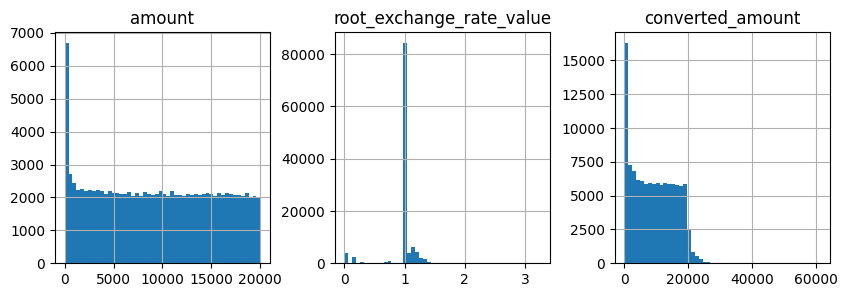
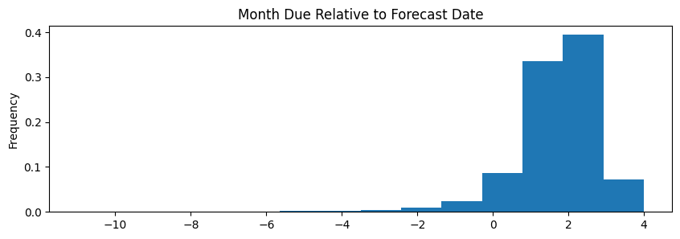
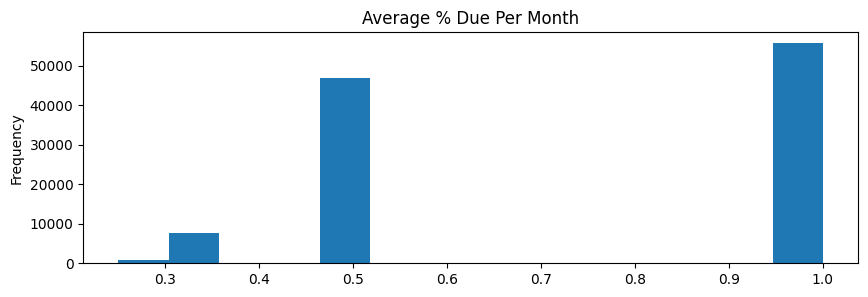
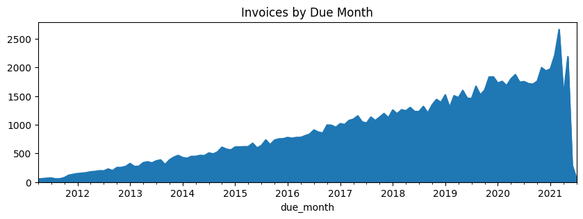
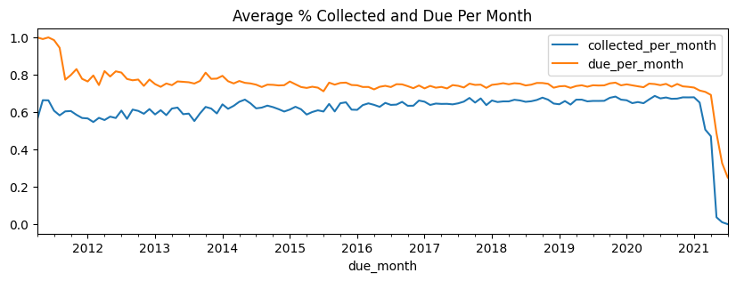
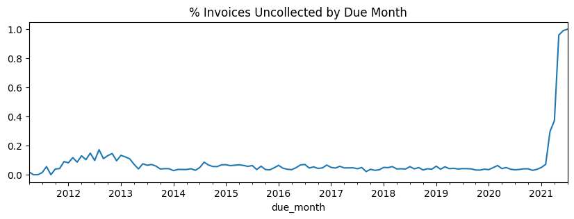

```python
%matplotlib inline
figsize = (10,3)
```
# Assess Input Datasets  


```python
import pandas, numpy
pandas.options.display.float_format = '{:,.4f}'.format
data_folder = '../data'
date_format='%Y-%m-%d' #truncate datetimes to dates
id_columns = ["id","company_id","invoice_id","account_id","customer_id"]
id_column_types = dict(zip(id_columns,[str] * len(id_columns)))
invoices = pandas.read_csv(data_folder + '/invoice.csv', na_values='inf', dtype=id_column_types,
                           parse_dates=['invoice_date', 'due_date', 'cleared_date'], date_format=date_format)
payments = pandas.read_csv(data_folder + '/invoice_payments.csv', na_values='inf', dtype=id_column_types,
                           parse_dates=['transaction_date'], date_format=date_format)
invoices.__len__(), payments.__len__()
```


    (113085, 111623)


## Determine Data Definitions and Relationships

***Define Datasets & Their Relationships***

We have two input datasets: invoices and their payments.

- Payments are amounts in time, which are directly mapped to companies. 
- Invoices can have multiple payments, but usually only have 1. 
- All payments have invoices, but not all invoices have payments.  


```python
invoices.rename(columns={"id":"invoice_id"}, inplace=True)
invoices.dtypes
```


    invoice_id                          object
    due_date                    datetime64[ns]
    invoice_date                datetime64[ns]
    status                              object
    amount_inv                         float64
    currency                            object
    company_id                          object
    customer_id                         object
    account_id                          object
    cleared_date                datetime64[ns]
    root_exchange_rate_value           float64
    dtype: object


```python
payments.dtypes
```


    amount                             float64
    root_exchange_rate_value           float64
    transaction_date            datetime64[ns]
    invoice_id                          object
    company_id                          object
    converted_amount                   float64
    dtype: object


```python
#The join key will be invoice_id, so it must be unique (and it is).
invoices.invoice_id.value_counts(dropna=False).value_counts(dropna=False)\
.to_frame(name="ids").rename_axis('invoices_per_id')
```


<div>
<style scoped>
    .dataframe tbody tr th:only-of-type {
        vertical-align: middle;
    }

    .dataframe tbody tr th {
        vertical-align: top;
    }

    .dataframe thead th {
        text-align: right;
    }
</style>
<table border="1" class="dataframe">
  <thead>
    <tr style="text-align: right;">
      <th></th>
      <th>ids</th>
    </tr>
    <tr>
      <th>invoices_per_id</th>
      <th></th>
    </tr>
  </thead>
  <tbody>
    <tr>
      <th>1</th>
      <td>113085</td>
    </tr>
  </tbody>
</table>
</div>


```python
#all payments are represented in both datasets 
len(set(payments.invoice_id) - set(invoices.invoice_id))
```


    0


```python
#7% of invoices do not have payments yet
len(set(invoices.invoice_id) - set(payments.invoice_id))/invoices.__len__()
```


    0.07127382057744175


```python
#invoices usually have one payment but may have more
payments.invoice_id.value_counts(dropna=False).value_counts(dropna=False, normalize=True)\
.to_frame(name="invoices").rename_axis('payments_per_invoice')
```


<div>
<style scoped>
    .dataframe tbody tr th:only-of-type {
        vertical-align: middle;
    }

    .dataframe tbody tr th {
        vertical-align: top;
    }

    .dataframe thead th {
        text-align: right;
    }
</style>
<table border="1" class="dataframe">
  <thead>
    <tr style="text-align: right;">
      <th></th>
      <th>invoices</th>
    </tr>
    <tr>
      <th>payments_per_invoice</th>
      <th></th>
    </tr>
  </thead>
  <tbody>
    <tr>
      <th>1</th>
      <td>0.9419</td>
    </tr>
    <tr>
      <th>2</th>
      <td>0.0548</td>
    </tr>
    <tr>
      <th>3</th>
      <td>0.0026</td>
    </tr>
    <tr>
      <th>4</th>
      <td>0.0006</td>
    </tr>
    <tr>
      <th>5</th>
      <td>0.0001</td>
    </tr>
    <tr>
      <th>6</th>
      <td>0.0001</td>
    </tr>
    <tr>
      <th>14</th>
      <td>0.0000</td>
    </tr>
    <tr>
      <th>9</th>
      <td>0.0000</td>
    </tr>
    <tr>
      <th>8</th>
      <td>0.0000</td>
    </tr>
    <tr>
      <th>7</th>
      <td>0.0000</td>
    </tr>
  </tbody>
</table>
</div>


***Define Entities & Their Relationships***

- Company: business entity for which Tesorio is forecasting cash collected. There are only two. Each company collects using multiple currencies from multiple customers. 
- Account: **In this limited dataset, accounts and companies are synonymous, so we ignore accounts.**  
- Customer: metadata about an invoice which is specific to each company. Each customer can have multiple currencies.


```python
invoices.groupby("company_id")[["customer_id","currency"]].nunique()
```


<div>
<style scoped>
    .dataframe tbody tr th:only-of-type {
        vertical-align: middle;
    }

    .dataframe tbody tr th {
        vertical-align: top;
    }

    .dataframe thead th {
        text-align: right;
    }
</style>
<table border="1" class="dataframe">
  <thead>
    <tr style="text-align: right;">
      <th></th>
      <th>customer_id</th>
      <th>currency</th>
    </tr>
    <tr>
      <th>company_id</th>
      <th></th>
      <th></th>
    </tr>
  </thead>
  <tbody>
    <tr>
      <th>114</th>
      <td>4509</td>
      <td>15</td>
    </tr>
    <tr>
      <th>14</th>
      <td>546</td>
      <td>13</td>
    </tr>
  </tbody>
</table>
</div>


```python
invoices.groupby("customer_id").company_id.nunique().value_counts()\
.to_frame(name='customers').rename_axis('companies_per_customer')
```


<div>
<style scoped>
    .dataframe tbody tr th:only-of-type {
        vertical-align: middle;
    }

    .dataframe tbody tr th {
        vertical-align: top;
    }

    .dataframe thead th {
        text-align: right;
    }
</style>
<table border="1" class="dataframe">
  <thead>
    <tr style="text-align: right;">
      <th></th>
      <th>customers</th>
    </tr>
    <tr>
      <th>companies_per_customer</th>
      <th></th>
    </tr>
  </thead>
  <tbody>
    <tr>
      <th>1</th>
      <td>5055</td>
    </tr>
  </tbody>
</table>
</div>


```python
invoices.groupby(["customer_id"]).currency.nunique().value_counts()\
.to_frame(name='customers').rename_axis('currencies_per_customer')
```


<div>
<style scoped>
    .dataframe tbody tr th:only-of-type {
        vertical-align: middle;
    }

    .dataframe tbody tr th {
        vertical-align: top;
    }

    .dataframe thead th {
        text-align: right;
    }
</style>
<table border="1" class="dataframe">
  <thead>
    <tr style="text-align: right;">
      <th></th>
      <th>customers</th>
    </tr>
    <tr>
      <th>currencies_per_customer</th>
      <th></th>
    </tr>
  </thead>
  <tbody>
    <tr>
      <th>1</th>
      <td>4426</td>
    </tr>
    <tr>
      <th>2</th>
      <td>583</td>
    </tr>
    <tr>
      <th>3</th>
      <td>39</td>
    </tr>
    <tr>
      <th>4</th>
      <td>7</td>
    </tr>
  </tbody>
</table>
</div>


```python
invoices.groupby("company_id").account_id.nunique().to_frame(name="unique_accounts")
```


<div>
<style scoped>
    .dataframe tbody tr th:only-of-type {
        vertical-align: middle;
    }

    .dataframe tbody tr th {
        vertical-align: top;
    }

    .dataframe thead th {
        text-align: right;
    }
</style>
<table border="1" class="dataframe">
  <thead>
    <tr style="text-align: right;">
      <th></th>
      <th>unique_accounts</th>
    </tr>
    <tr>
      <th>company_id</th>
      <th></th>
    </tr>
  </thead>
  <tbody>
    <tr>
      <th>114</th>
      <td>1</td>
    </tr>
    <tr>
      <th>14</th>
      <td>1</td>
    </tr>
  </tbody>
</table>
</div>


```python
invoices.groupby("account_id").company_id.nunique().value_counts()\
.to_frame(name='count').rename_axis('companies_per_account')
```


<div>
<style scoped>
    .dataframe tbody tr th:only-of-type {
        vertical-align: middle;
    }

    .dataframe tbody tr th {
        vertical-align: top;
    }

    .dataframe thead th {
        text-align: right;
    }
</style>
<table border="1" class="dataframe">
  <thead>
    <tr style="text-align: right;">
      <th></th>
      <th>count</th>
    </tr>
    <tr>
      <th>companies_per_account</th>
      <th></th>
    </tr>
  </thead>
  <tbody>
    <tr>
      <th>1</th>
      <td>2</td>
    </tr>
  </tbody>
</table>
</div>


## Identify Data Cleaning Needs

***Payments***

Transaction data begins in 2011 and ends 2021-05-18. We will assume this is when the data was pulled. Based on volume, the last month appears to have an unrepresentative set of payments, so we filter out those payments. 


```python
payments.__len__()
payments['transaction_month'] = payments.transaction_date.dt.to_period('M').dt.to_timestamp()
payments.groupby("transaction_month").invoice_id.nunique()\
.plot(kind='area', title="Payments by Transaction Month", figsize=figsize)
```


    <Axes: title={'center': 'Payments by Transaction Month'}, xlabel='transaction_month'>


```python
payments = payments[payments.transaction_month<payments.transaction_month.max()]
last_complete_transaction_month = payments.transaction_month.max()
first_transaction_month = payments.transaction_month.min()
first_transaction_month, last_complete_transaction_month
```


    (Timestamp('2011-04-01 00:00:00'), Timestamp('2021-04-01 00:00:00'))


```python
#converted_amount is reliable
(((payments.amount * payments.root_exchange_rate_value) - payments.converted_amount).abs()).max()
```


    1.0913936421275139e-11


```python
payments[payments.amount.isnull()!=payments.converted_amount.isnull()].__len__()
```


    0


```python
payment_stats = payments.describe(include='all')
payment_stats.loc['% populated'] = payment_stats.loc['count']/payments.__len__()
payment_stats
```


<div>
<style scoped>
    .dataframe tbody tr th:only-of-type {
        vertical-align: middle;
    }

    .dataframe tbody tr th {
        vertical-align: top;
    }

    .dataframe thead th {
        text-align: right;
    }
</style>
<table border="1" class="dataframe">
  <thead>
    <tr style="text-align: right;">
      <th></th>
      <th>amount</th>
      <th>root_exchange_rate_value</th>
      <th>transaction_date</th>
      <th>invoice_id</th>
      <th>company_id</th>
      <th>converted_amount</th>
      <th>transaction_month</th>
    </tr>
  </thead>
  <tbody>
    <tr>
      <th>count</th>
      <td>111,332.0000</td>
      <td>111,333.0000</td>
      <td>111333</td>
      <td>111333</td>
      <td>111333</td>
      <td>111,332.0000</td>
      <td>111333</td>
    </tr>
    <tr>
      <th>unique</th>
      <td>NaN</td>
      <td>NaN</td>
      <td>NaN</td>
      <td>104755</td>
      <td>2</td>
      <td>NaN</td>
      <td>NaN</td>
    </tr>
    <tr>
      <th>top</th>
      <td>NaN</td>
      <td>NaN</td>
      <td>NaN</td>
      <td>48171</td>
      <td>114</td>
      <td>NaN</td>
      <td>NaN</td>
    </tr>
    <tr>
      <th>freq</th>
      <td>NaN</td>
      <td>NaN</td>
      <td>NaN</td>
      <td>14</td>
      <td>107847</td>
      <td>NaN</td>
      <td>NaN</td>
    </tr>
    <tr>
      <th>mean</th>
      <td>9,416.6999</td>
      <td>0.9684</td>
      <td>2018-03-01 09:23:10.779013888</td>
      <td>NaN</td>
      <td>NaN</td>
      <td>9,129.3573</td>
      <td>2018-02-14 09:25:01.754196736</td>
    </tr>
    <tr>
      <th>min</th>
      <td>0.0000</td>
      <td>0.0008</td>
      <td>2011-04-13 00:00:00</td>
      <td>NaN</td>
      <td>NaN</td>
      <td>0.0000</td>
      <td>2011-04-01 00:00:00</td>
    </tr>
    <tr>
      <th>25%</th>
      <td>4,077.8203</td>
      <td>1.0000</td>
      <td>2016-08-02 00:00:00</td>
      <td>NaN</td>
      <td>NaN</td>
      <td>3,180.9875</td>
      <td>2016-08-01 00:00:00</td>
    </tr>
    <tr>
      <th>50%</th>
      <td>9,332.1217</td>
      <td>1.0000</td>
      <td>2018-08-15 00:00:00</td>
      <td>NaN</td>
      <td>NaN</td>
      <td>8,819.6202</td>
      <td>2018-08-01 00:00:00</td>
    </tr>
    <tr>
      <th>75%</th>
      <td>14,651.1144</td>
      <td>1.0000</td>
      <td>2020-02-12 00:00:00</td>
      <td>NaN</td>
      <td>NaN</td>
      <td>14,612.8782</td>
      <td>2020-02-01 00:00:00</td>
    </tr>
    <tr>
      <th>max</th>
      <td>19,999.8792</td>
      <td>3.2533</td>
      <td>2021-04-30 00:00:00</td>
      <td>NaN</td>
      <td>NaN</td>
      <td>61,209.4348</td>
      <td>2021-04-01 00:00:00</td>
    </tr>
    <tr>
      <th>std</th>
      <td>6,015.4530</td>
      <td>0.2445</td>
      <td>NaN</td>
      <td>NaN</td>
      <td>NaN</td>
      <td>6,438.9632</td>
      <td>NaN</td>
    </tr>
    <tr>
      <th>% populated</th>
      <td>1.0000</td>
      <td>1.0000</td>
      <td>1.0000</td>
      <td>1.0000</td>
      <td>1.0000</td>
      <td>1.0000</td>
      <td>1.0000</td>
    </tr>
  </tbody>
</table>
</div>


```python
payments.select_dtypes(include='float').hist(bins=50, figsize=figsize, layout=(1,3))
```


    array([[<Axes: title={'center': 'amount'}>,
            <Axes: title={'center': 'root_exchange_rate_value'}>,
            <Axes: title={'center': 'converted_amount'}>]], dtype=object)





***Invoice Dates***

- Date range is different from payments. Filter dates out of range to ensure invoices have complete payment history.
- Invoice can be opened with a past due date. Filter these out. 
- Invoices due 4+ months after opened are negligible: remove. 
- Invoices cleared before or 13+ months after opened are negligible: remove. 


```python
invoices['invoice_month'] = invoices.invoice_date.dt.to_period('M').dt.to_timestamp()
invoices['due_month'] = invoices.due_date.dt.to_period('M').dt.to_timestamp()
invoices.groupby("invoice_month").invoice_id.count()\
.plot(kind='area', title="Invoices by Invoice Month", figsize=figsize)
```


    <Axes: title={'center': 'Invoices by Invoice Month'}, xlabel='invoice_month'>


```python
#opened after they were due or before of payment data begins -  filter 
print(invoices.loc[invoices.invoice_month.dt.to_period('M')>invoices.due_month.dt.to_period('M')].__len__(), 
invoices.loc[invoices.invoice_month<first_transaction_month].__len__())
invoices = invoices.loc[(invoices.invoice_month<=invoices.due_date.dt.to_period('M').dt.to_timestamp()) &
                        (invoices.invoice_month>=first_transaction_month)]
```
    14 58


```python
#need to filter out invoices due in the future relative to the payment date window
invoices.groupby("due_month").invoice_id.count()\
.plot(kind='area', title="Invoices by Due Month", figsize=figsize)
```


    <Axes: title={'center': 'Invoices by Due Month'}, xlabel='due_month'>


```python
invoices['months_allowed'] = invoices.due_month.dt.to_period('M') - invoices.invoice_month.dt.to_period('M')
invoices.months_allowed = invoices.months_allowed.map(lambda m: m.n if not pandas.isnull(m) else None)
#almost all invoices are due immediately or within 3 months. 
invoices.months_allowed.value_counts(normalize=True, dropna=False)
```


    months_allowed
    1    0.7643
    2    0.1806
    0    0.0325
    3    0.0198
    5    0.0009
    4    0.0008
    6    0.0003
    7    0.0002
    11   0.0001
    8    0.0001
    9    0.0001
    12   0.0001
    10   0.0001
    13   0.0000
    18   0.0000
    14   0.0000
    16   0.0000
    19   0.0000
    15   0.0000
    Name: proportion, dtype: float64


```python
invoices = invoices[invoices.months_allowed<=3]
```

```python
invoices['months_to_clear'] = invoices.cleared_date.dt.to_period('M') \
- invoices.invoice_date.dt.to_period('M')
invoices.months_to_clear = invoices.months_to_clear.map(lambda m: m.n if not pandas.isnull(m) else None)
#almost all invoices are cleared within a year. 
# filter out ones that cleared before or 13+ months after they opened
invoices.months_to_clear.value_counts(normalize=True, dropna=False).head(20)
```


    months_to_clear
     1    0.4516
     2    0.2660
     3    0.0808
     0    0.0720
     4    0.0317
     9    0.0212
     5    0.0183
     6    0.0116
     10   0.0085
     7    0.0084
     8    0.0080
     12   0.0066
     11   0.0044
    -1    0.0016
     13   0.0015
     14   0.0012
     15   0.0009
    -2    0.0006
     16   0.0006
     17   0.0005
    Name: proportion, dtype: float64


```python
invoices = invoices[(invoices.months_to_clear.isnull()) | (invoices.months_to_clear.between(0,12))]
```

```python
invoices_stats = invoices.describe(include='all')
invoices_stats.loc['% populated'] = invoices_stats.loc['count']/invoices.__len__()
invoices_stats
```


<div>
<style scoped>
    .dataframe tbody tr th:only-of-type {
        vertical-align: middle;
    }

    .dataframe tbody tr th {
        vertical-align: top;
    }

    .dataframe thead th {
        text-align: right;
    }
</style>
<table border="1" class="dataframe">
  <thead>
    <tr style="text-align: right;">
      <th></th>
      <th>invoice_id</th>
      <th>due_date</th>
      <th>invoice_date</th>
      <th>status</th>
      <th>amount_inv</th>
      <th>currency</th>
      <th>company_id</th>
      <th>customer_id</th>
      <th>account_id</th>
      <th>cleared_date</th>
      <th>root_exchange_rate_value</th>
      <th>invoice_month</th>
      <th>due_month</th>
      <th>months_allowed</th>
      <th>months_to_clear</th>
    </tr>
  </thead>
  <tbody>
    <tr>
      <th>count</th>
      <td>111462</td>
      <td>111462</td>
      <td>111462</td>
      <td>111462</td>
      <td>111,462.0000</td>
      <td>111462</td>
      <td>111462</td>
      <td>111462</td>
      <td>111462</td>
      <td>111462</td>
      <td>111,462.0000</td>
      <td>111462</td>
      <td>111462</td>
      <td>111,462.0000</td>
      <td>111,462.0000</td>
    </tr>
    <tr>
      <th>unique</th>
      <td>111462</td>
      <td>NaN</td>
      <td>NaN</td>
      <td>2</td>
      <td>NaN</td>
      <td>17</td>
      <td>2</td>
      <td>4947</td>
      <td>2</td>
      <td>NaN</td>
      <td>NaN</td>
      <td>NaN</td>
      <td>NaN</td>
      <td>NaN</td>
      <td>NaN</td>
    </tr>
    <tr>
      <th>top</th>
      <td>0</td>
      <td>NaN</td>
      <td>NaN</td>
      <td>CLEARED</td>
      <td>NaN</td>
      <td>USD</td>
      <td>114</td>
      <td>5</td>
      <td>0</td>
      <td>NaN</td>
      <td>NaN</td>
      <td>NaN</td>
      <td>NaN</td>
      <td>NaN</td>
      <td>NaN</td>
    </tr>
    <tr>
      <th>freq</th>
      <td>1</td>
      <td>NaN</td>
      <td>NaN</td>
      <td>107869</td>
      <td>NaN</td>
      <td>84290</td>
      <td>108346</td>
      <td>1784</td>
      <td>108346</td>
      <td>NaN</td>
      <td>NaN</td>
      <td>NaN</td>
      <td>NaN</td>
      <td>NaN</td>
      <td>NaN</td>
    </tr>
    <tr>
      <th>mean</th>
      <td>NaN</td>
      <td>2018-04-02 02:37:01.973408</td>
      <td>2018-02-25 16:02:50.533455360</td>
      <td>NaN</td>
      <td>10,031.7149</td>
      <td>NaN</td>
      <td>NaN</td>
      <td>NaN</td>
      <td>NaN</td>
      <td>2018-04-27 11:50:58.943855360</td>
      <td>0.9694</td>
      <td>2018-02-09 05:02:06.931151616</td>
      <td>2018-03-17 08:32:07.028045824</td>
      <td>1.1882</td>
      <td>2.0628</td>
    </tr>
    <tr>
      <th>min</th>
      <td>NaN</td>
      <td>2011-04-02 00:00:00</td>
      <td>2011-04-02 00:00:00</td>
      <td>NaN</td>
      <td>0.0276</td>
      <td>NaN</td>
      <td>NaN</td>
      <td>NaN</td>
      <td>NaN</td>
      <td>2011-04-24 00:00:00</td>
      <td>0.0008</td>
      <td>2011-04-01 00:00:00</td>
      <td>2011-04-01 00:00:00</td>
      <td>0.0000</td>
      <td>0.0000</td>
    </tr>
    <tr>
      <th>25%</th>
      <td>NaN</td>
      <td>2016-09-06 00:00:00</td>
      <td>2016-07-28 00:00:00</td>
      <td>NaN</td>
      <td>5,032.6881</td>
      <td>NaN</td>
      <td>NaN</td>
      <td>NaN</td>
      <td>NaN</td>
      <td>2016-09-21 00:00:00</td>
      <td>1.0000</td>
      <td>2016-07-01 00:00:00</td>
      <td>2016-09-01 00:00:00</td>
      <td>1.0000</td>
      <td>1.0000</td>
    </tr>
    <tr>
      <th>50%</th>
      <td>NaN</td>
      <td>2018-09-26 00:00:00</td>
      <td>2018-08-22 00:00:00</td>
      <td>NaN</td>
      <td>10,024.7726</td>
      <td>NaN</td>
      <td>NaN</td>
      <td>NaN</td>
      <td>NaN</td>
      <td>2018-10-13 00:00:00</td>
      <td>1.0000</td>
      <td>2018-08-01 00:00:00</td>
      <td>2018-09-01 00:00:00</td>
      <td>1.0000</td>
      <td>1.0000</td>
    </tr>
    <tr>
      <th>75%</th>
      <td>NaN</td>
      <td>2020-03-24 00:00:00</td>
      <td>2020-02-19 00:00:00</td>
      <td>NaN</td>
      <td>15,038.2076</td>
      <td>NaN</td>
      <td>NaN</td>
      <td>NaN</td>
      <td>NaN</td>
      <td>2020-04-19 00:00:00</td>
      <td>1.0000</td>
      <td>2020-02-01 00:00:00</td>
      <td>2020-03-01 00:00:00</td>
      <td>1.0000</td>
      <td>2.0000</td>
    </tr>
    <tr>
      <th>max</th>
      <td>NaN</td>
      <td>2022-02-15 00:00:00</td>
      <td>2022-01-09 00:00:00</td>
      <td>NaN</td>
      <td>19,999.9749</td>
      <td>NaN</td>
      <td>NaN</td>
      <td>NaN</td>
      <td>NaN</td>
      <td>2022-01-01 00:00:00</td>
      <td>1.6816</td>
      <td>2022-01-01 00:00:00</td>
      <td>2022-02-01 00:00:00</td>
      <td>3.0000</td>
      <td>12.0000</td>
    </tr>
    <tr>
      <th>std</th>
      <td>NaN</td>
      <td>NaN</td>
      <td>NaN</td>
      <td>NaN</td>
      <td>5,769.0508</td>
      <td>NaN</td>
      <td>NaN</td>
      <td>NaN</td>
      <td>NaN</td>
      <td>NaN</td>
      <td>0.2456</td>
      <td>NaN</td>
      <td>NaN</td>
      <td>0.5067</td>
      <td>2.1074</td>
    </tr>
    <tr>
      <th>% populated</th>
      <td>1.0000</td>
      <td>1.0000</td>
      <td>1.0000</td>
      <td>1.0000</td>
      <td>1.0000</td>
      <td>1.0000</td>
      <td>1.0000</td>
      <td>1.0000</td>
      <td>1.0000</td>
      <td>1.0000</td>
      <td>1.0000</td>
      <td>1.0000</td>
      <td>1.0000</td>
      <td>1.0000</td>
      <td>1.0000</td>
    </tr>
  </tbody>
</table>
</div>


***Invoice status vs cleared date***

All invoices have a date cleared, even the 3% that are open. Although these cases span multiple invoice dates, the cleared_date is all one value, which is in the future relative to when the data was pulled, so we remove it. 


```python
invoices.loc[invoices.cleared_date.isnull()].__len__()
```


    0


```python
invoices.status.value_counts(normalize=True, dropna=False).to_frame(name="% of Invoices")
```


<div>
<style scoped>
    .dataframe tbody tr th:only-of-type {
        vertical-align: middle;
    }

    .dataframe tbody tr th {
        vertical-align: top;
    }

    .dataframe thead th {
        text-align: right;
    }
</style>
<table border="1" class="dataframe">
  <thead>
    <tr style="text-align: right;">
      <th></th>
      <th>% of Invoices</th>
    </tr>
    <tr>
      <th>status</th>
      <th></th>
    </tr>
  </thead>
  <tbody>
    <tr>
      <th>CLEARED</th>
      <td>0.9678</td>
    </tr>
    <tr>
      <th>OPEN</th>
      <td>0.0322</td>
    </tr>
  </tbody>
</table>
</div>


```python
open_status = (invoices.status=='OPEN')
invoices.loc[invoices.cleared_date.isnull() != open_status,['status','cleared_date']]\
.value_counts(dropna=False)
```


    status  cleared_date
    OPEN    2022-01-01      3593
    Name: count, dtype: int64


```python
#all open invoices have the same cleared date, which is after the latest payment data 
invoices.loc[open_status].cleared_date.value_counts(dropna=False)
```


    cleared_date
    2022-01-01    3593
    Name: count, dtype: int64


```python
#this is in spite of having multiple invoice dates
invoices.loc[open_status].invoice_date.agg(['min', 'max'])
```


    min   2021-01-01
    max   2022-01-09
    Name: invoice_date, dtype: datetime64[ns]


```python
invoices['cleared_month'] = invoices.cleared_date.dt.to_period('M').dt.to_timestamp()
#last month we will generate a forecast 
#To ensure completeness, the months we use for modeling must fall within the payments data date range. 
invoices['final_month_open'] = invoices.cleared_month.map(
    lambda cleared_month: min(cleared_month,last_complete_transaction_month)
)
invoices.loc[open_status,'cleared_date'] = None
invoices.loc[open_status,'cleared_month'] = None
```
***Exchange Rate***

USD exchange rate has some inaccurate outliers: remove. The exchange rate on the invoice seems to be taken from when the invoice is opened. 


```python
invoices.query("currency=='USD'").root_exchange_rate_value.describe(percentiles=[0.0001,0.9999])
```


    count    84,290.0000
    mean          1.0000
    std           0.0030
    min           0.2499
    0.01%         0.9644
    50%           1.0000
    99.99%        1.0488
    max           1.3045
    Name: root_exchange_rate_value, dtype: float64


```python
invoices.query("currency=='USD' and root_exchange_rate_value<0.7").__len__()
```


    1


```python
invoices.query("currency=='USD' and root_exchange_rate_value>1.3").__len__()
```


    1


```python
invoices = invoices.loc[(invoices.currency!='USD') | (invoices.root_exchange_rate_value.between(0.7,1.3))]
```

```python
usd_currency_ranges = invoices.query("currency=='USD'").groupby("invoice_month").root_exchange_rate_value\
.agg(['min','max'])
usd_currency_ranges['spread_ratio'] = usd_currency_ranges['max']/usd_currency_ranges['min']
usd_currency_ranges.spread_ratio.plot(kind='line', title="USD Exchange Rate Spread Ratio By Invoice Month",
                                       figsize=figsize)
```


    <Axes: title={'center': 'USD Exchange Rate Spread Ratio By Invoice Month'}, xlabel='invoice_month'>


```python
usd_currency_ranges = invoices.query("currency=='USD'").groupby("cleared_month").root_exchange_rate_value\
.agg(['min','max'])
(usd_currency_ranges['max']/usd_currency_ranges['min']).sort_values()\
.plot(kind='line', title="USD Exchange Rate Spread Ratio By Cleared Month", figsize=figsize)
```


    <Axes: title={'center': 'USD Exchange Rate Spread Ratio By Cleared Month'}, xlabel='cleared_month'>


***Merging & Checking for Consistency***

- Companies are consistent between payments and invoices, when payments are present. 
- Amounts and exchange rates are expected to differ between invoices and payments. 


```python
invoices['converted_amount'] = invoices.amount_inv * invoices.root_exchange_rate_value
```

```python
invoice_payments = invoices.rename(columns={"amount_inv":"amount"})\
.merge(payments, on="invoice_id", how='left', suffixes=('_inv', '_pmt'))
# #update cleared_date to be up to the point in time of the payment
# cleared_in_future = invoice_payments.cleared_date>invoice_payments.transaction_date
# invoice_payments.loc[cleared_in_future,'cleared_month'] = None
# invoice_payments.loc[cleared_in_future,'months_to_clear'] = None
invoice_payments.drop(columns=['cleared_date'], inplace=True)
```

```python
invoice_payments.invoice_id.nunique()
```


    111460


```python
#no payment is more than the invoice amount in the original currency
invoice_payments.loc[invoice_payments.amount_pmt>invoice_payments.amount_inv].__len__()
```


    0


```python
duplicated_columns = [col.replace('_pmt','') for col in invoice_payments.columns if col.endswith('_pmt')]
for col in  duplicated_columns:
    if col in ('amount', 'converted_amount', 'root_exchange_rate_value'):
        continue
    inconsistent_rows = invoice_payments.loc[(invoice_payments[f"{col}_pmt"].isnull()==False) & 
                                 (invoice_payments[f"{col}_pmt"]!=invoice_payments[f"{col}_inv"])]
    print(f"{col}: {inconsistent_rows.__len__()/invoice_payments.__len__()} inconsistent rows after merge")
```
    company_id: 0.0 inconsistent rows after merge


```python
invoice_payments = invoice_payments.drop(columns=['company_id_pmt'])\
.rename(columns={"company_id_inv":"company_id"})
```
## Establish Business Rules

- Payments are collected based on the invoice currency.
- Payments cannot be more than what is owed: ignore payments that exceed amount remaining.
- Payments can be less than what is owed:
    - Payments can be a negligible % of the invoice, but are always non-zero.
    - Consider an invoice "collected" when paid > 99.99%.
- Once collected, an invoice is cleared:
    - Invoices can be cleared prematurely without being collected. 
    - When an invoice is cleared prematurely, it won't be collected.
- Regardless of status, invoices can have zero payments. 


```python
#using USD to determine collection would mean 9% of payments are greater than their invoice amount
(invoice_payments.converted_amount_pmt>invoice_payments.converted_amount_inv).mean()
```


    0.09213418308030448


```python
# Rougly 12% of payments are partial
invoice_payments['amount_pmt_pct'] = (invoice_payments.amount_pmt/invoice_payments.amount_inv)
(invoice_payments.amount_pmt_pct.dropna()<1).mean()
```


    0.12204495484527465


```python
#on average, a payment is 94% of the invoice
invoice_payments.amount_pmt_pct.mean()
```


    0.9395345288787842


```python
# negligible amounts are a small fraction of payments
invoice_payments.amount_pmt_pct.min(), (invoice_payments.amount_pmt_pct<=0.0001).mean()
```


    (1.168831155169506e-08, 0.0023252064257164437)


```python
invoice_payments.sort_values(by=['invoice_id','transaction_date'], inplace=True)
#round to eliminate the impact of negligible payments
#hence, an invoice is "collected" when paid > 99.99%.
invoice_payments['amount_pmt_pct_cum'] = invoice_payments.groupby("invoice_id").amount_pmt_pct.cumsum()\
.fillna(0).round(4)
```

```python
#small percent of payments represent overpayments - filter out
print((invoice_payments.amount_pmt_pct_cum>1).mean())
invoice_payments = invoice_payments[invoice_payments.amount_pmt_pct_cum<=1].copy()
#dedupe by invoice id and payment month, using the last transaction for each
invoice_payments.drop_duplicates(subset=['invoice_id','transaction_month'], keep='last', inplace=True)
#dedupe by invoice id and cumulative amount paid, using the first transaction for each (dupes are very rare)
invoice_payments.drop_duplicates(subset=['invoice_id','amount_pmt_pct_cum'], keep='first', inplace=True)
# invoice is collected if/when payments accumulate to the invoice amount in the original currency.
collected = invoice_payments.amount_pmt_pct_cum==1
invoice_payments['collected'] = collected
invoice_payments.loc[collected, 'collected_month'] = invoice_payments.loc[collected, 'transaction_month']
assert invoice_payments.groupby("invoice_id").collected_month.nunique().max()==1
```
    0.00046673851611096496


```python
#small percent collected before active - filter out
print((invoice_payments.collected_month<invoice_payments.invoice_month).mean())
invoice_payments = invoice_payments[(invoice_payments.collected_month>=invoice_payments.invoice_month) |
                                    (invoice_payments.collected_month.isnull())]
```
    0.000453510706409618


***Cleared vs Collected***


```python
#Only one invoice was collected after being cleared. Remove as an outlier.
print(invoice_payments.query("cleared_month<collected_month").__len__())
invoice_payments = invoice_payments[~(invoice_payments.cleared_month<invoice_payments.collected_month)]
```
    1


```python
#2 records are collected but have 'OPEN' status / no cleared date  - remove
print(invoice_payments.loc[(invoice_payments.collected) & (invoice_payments.cleared_month.isnull())]\
.status.value_counts())
invoice_payments = invoice_payments.loc[(invoice_payments.collected==False) | 
                                        (invoice_payments.cleared_month.isnull()==False)]
```
    status
    OPEN    2
    Name: count, dtype: int64


```python
invoice_payments.__len__(), invoice_payments.invoice_id.nunique()
```


    (112402, 111406)


```python
assert invoice_payments.groupby("invoice_id").cleared_month.nunique().max()==1
assert invoice_payments.groupby("invoice_id").collected_month.nunique().max()==1
```

```python
invoice_end_state = invoice_payments.drop_duplicates(subset='invoice_id', keep='last').copy()
#all collected invoices are cleared. however, not all cleared invoices were collected. 
#the 60% of uncollected invoices that were cleared took over 2x as long to clear vs collected ones
#this suggests that they're being cleared as part of a separate process. 
invoice_end_state['cleared'] = invoice_end_state.status=='CLEARED'
invoice_end_state['periods_to_clear'] = invoice_end_state.months_to_clear/(invoice_end_state.months_allowed+1)
invoice_end_state.groupby("collected", as_index=False)[['cleared','months_to_clear','periods_to_clear']].mean()
```


<div>
<style scoped>
    .dataframe tbody tr th:only-of-type {
        vertical-align: middle;
    }

    .dataframe tbody tr th {
        vertical-align: top;
    }

    .dataframe thead th {
        text-align: right;
    }
</style>
<table border="1" class="dataframe">
  <thead>
    <tr style="text-align: right;">
      <th></th>
      <th>collected</th>
      <th>cleared</th>
      <th>months_to_clear</th>
      <th>periods_to_clear</th>
    </tr>
  </thead>
  <tbody>
    <tr>
      <th>0</th>
      <td>False</td>
      <td>0.6046</td>
      <td>4.8823</td>
      <td>2.2329</td>
    </tr>
    <tr>
      <th>1</th>
      <td>True</td>
      <td>1.0000</td>
      <td>1.8128</td>
      <td>0.8374</td>
    </tr>
  </tbody>
</table>
</div>


```python
# 92% of invoices are collected 
invoice_end_state.collected.mean()
```


    0.9184693822594834


```python
#95% of cleared invoices are collected, representing 96% of totals on average. 
invoice_end_state.loc[invoice_end_state.status=='CLEARED',['collected','amount_pmt_pct_cum']].mean()
```


    collected            0.9491
    amount_pmt_pct_cum   0.9581
    dtype: float64


# Structure Input Data for Modeling

- The model will handle OPEN invoices and classify how many months in the future they will be collected. 
    - Define an invoice as open/active between its invoice date and date cleared or collected, whichever is first. 
- Forecasts will be generated once at the beginning of each month. To model the data, we select a representative forecast month by randomly sampling one past month per invoice:
    - Begin forecast window when the invoice is active and the payments data is complete
    - End forecast window when invoice is collected. 
    - For open invoices to be included in model training, end the forecast window when payments data ends. 


- Normalizing by company:
    - Tesorio's pricing model is subscription, so Tesorio's revenue will be loosely based on paying customers per period. 
    - Normalizing USD amounts by company means each company will be of equal value each month they retain with Tesorio, regardless of their total cash flow. 


```python
import random

def select_forecast_month(invoice_id, invoice_month, max_forecast_month):
    if pandas.isnull(max_forecast_month):
        return None
    #begin forecast window when the invoice is active and the payments data is complete
    period_start = max(invoice_month,first_transaction_month)
    period_range = pandas.period_range(period_start, max_forecast_month, freq='M')
    if len(period_range)==0:
        return None
    #ensure consistent forecast month per invoice across payments
    psuedorandom = random.Random(invoice_id)
    return psuedorandom.choice(period_range)

select_forecast_month = numpy.vectorize(select_forecast_month)
invoice_payments['forecast_month_collected'] = select_forecast_month(invoice_payments.invoice_id, 
                                                           invoice_payments.invoice_month, 
                                                           invoice_payments.collected_month)
invoice_payments['forecast_month_uncollected'] = select_forecast_month(invoice_payments.invoice_id, 
                                                           invoice_payments.invoice_month, 
                                                           invoice_payments.final_month_open)
assert invoice_payments.groupby("invoice_id").forecast_month_collected.nunique().max()==1
assert invoice_payments.groupby("invoice_id").forecast_month_uncollected.nunique().max()==1
```

```python
invoice_payments.__len__(), invoice_payments.invoice_id.nunique()
```


    (112402, 111406)


```python
#should be the same date ranges for both options
assert (invoice_payments.forecast_month_uncollected.agg(['min','max']).values==\
invoice_payments.forecast_month_collected.agg(['min','max']).values).max()
```

```python
import random

def process_model_inputs(invoice_payments, current_state_month=None):
    #last record for each invoice has columns associated with collected date 
    invoice_point_in_time = invoice_payments.drop_duplicates(subset='invoice_id', keep='last').copy()
    if current_state_month: #prepare for live scoring on trained model
        forecast_month = current_state_month
    else: #use random valid past month per invoice to train model
        forecast_month = invoice_point_in_time.forecast_month_collected.fillna(
            invoice_point_in_time.forecast_month_uncollected) 
    invoice_point_in_time['forecast_month'] = forecast_month
    final_state_columns = ['amount_pmt_pct_cum',"collected_month","final_month_open"]
    invoice_point_in_time = invoice_point_in_time[["invoice_id","forecast_month"]+final_state_columns].dropna(
        subset=["invoice_id","forecast_month"]
    )
    invoice_payments_point_in_time = invoice_point_in_time.merge(
        invoice_payments,on="invoice_id", how="inner", suffixes=('','_final')
    ).sort_values(by=['invoice_id','transaction_month'])
    #last payment record for each invoice 
    invoices_to_score = invoice_payments_point_in_time.drop_duplicates(subset='invoice_id', keep='last')
    #get invoice payment state before the forecast month. if there is no forecast month, get all data 
    last_prior_payment_state = invoice_payments_point_in_time.loc[
        (invoice_payments_point_in_time.transaction_month<
         invoice_payments_point_in_time.forecast_month.dt.to_timestamp()),
        ['invoice_id','amount_pmt_pct_cum','transaction_month']
    ] 
    #get the last payment state prior to the invoice forecast month
    last_prior_payment_state.drop_duplicates(subset='invoice_id', keep='last', inplace=True)
    invoices_to_score = invoices_to_score\
    .merge(last_prior_payment_state, how='left', on='invoice_id',suffixes=('', '_prior'))
    invoices_to_score['prior_remaining_inv_pct'] = 1 - invoices_to_score.amount_pmt_pct_cum_prior.fillna(0)
    invoices_to_score['final_remaining_inv_pct'] = 1 - invoices_to_score.amount_pmt_pct_cum_final.fillna(0)
    invoices_to_score['months_to_final_state'] =  (
        invoices_to_score.collected_month.fillna(invoices_to_score.final_month_open).dt.to_period('M') 
        - invoices_to_score.forecast_month).map(lambda m: m.n+1 if not pandas.isnull(m) else 1)
    invoices_to_score['collected_per_month'] = (
        (invoices_to_score.prior_remaining_inv_pct - invoices_to_score.final_remaining_inv_pct)/
        invoices_to_score.months_to_final_state
    )
    columns_to_model = ['invoice_id','invoice_month','forecast_month','due_month','months_allowed',
                         'amount_inv','converted_amount_inv', 'currency','company_id','customer_id',
                         'collected_month','prior_remaining_inv_pct','final_remaining_inv_pct',
                         'months_to_final_state','collected_per_month', 'status']
    invoices_to_score = invoices_to_score[columns_to_model]
    #normalize USD amounts by company
    totals_by_company = invoices_to_score.groupby("company_id", as_index=False).converted_amount_inv.sum()
    invoices_to_score = invoices_to_score.merge(totals_by_company,on="company_id", suffixes=('','_company'))
    inv_pct_of_company_total = invoices_to_score.converted_amount_inv\
                                                    /invoices_to_score.converted_amount_inv_company
    invoices_to_score['inv_pct_of_company_total'] = inv_pct_of_company_total
    invoices_to_score.drop(columns=["converted_amount_inv"], inplace=True)
    #date quantities
    invoices_to_score['months_open'] = (invoices_to_score.forecast_month \
                                          - invoices_to_score.invoice_month.dt.to_period('M'))\
                                                    .map(lambda m: m.n+1 if not pandas.isnull(m) else None)
    invoices_to_score['month_due'] = (invoices_to_score.due_month.dt.to_period('M') \
                                      - invoices_to_score.forecast_month)\
                                                    .map(lambda m: m.n+1 if not pandas.isnull(m) else None)
    invoices_to_score.forecast_month = invoices_to_score.forecast_month.dt.to_timestamp()
    # late invoices should not impact the % of the invoice due per month.   
    invoices_to_score['due_per_month'] = 1/invoices_to_score.month_due.clip(lower=1)
    return invoices_to_score

invoices_to_model = process_model_inputs(invoice_payments)
#one record per invoice
assert invoices_to_model.groupby("invoice_id").count().max().max()==1
#always has a collection rate
assert (invoices_to_model.collected_per_month.isnull()).sum()==0
```

```python
open_invoices_to_model = invoices_to_model.query("status=='OPEN'")
assert open_invoices_to_model.collected_month.count()==0
#open_invoices_to_model[['invoice_month','due_month','forecast_month']].agg(['min','max','count'])

#todo: this should be a test
current_open_invoices = process_model_inputs(invoice_payments.query("status=='OPEN'"), 
                                 current_state_month=last_complete_transaction_month.to_period('M'))
#one record per invoice
assert current_open_invoices.groupby("invoice_id").count().max().max()==1
assert current_open_invoices.collected_month.count()==0
current_open_invoices.drop(columns=['collected_month','collected_per_month'], inplace=True)
#current_open_invoices[['invoice_month','due_month','forecast_month']].agg(['min','max','count'])
```
# Analyze and Refine Data to Be Modeled


```python
#Collection speed slows down sharply for invoices due a month or more in the future
invoices_to_model.groupby("month_due").collected_per_month.mean()\
.plot(figsize=figsize, title="Average % Collected Per Month by Month Due")
```


    <Axes: title={'center': 'Average % Collected Per Month by Month Due'}, xlabel='month_due'>


```python
#Long left tail is clipped when calculating % of invoice due per month looking forward
invoices_to_model.month_due.plot(kind='hist', bins=14, figsize=figsize, 
 title="Month Due Relative to Forecast Date", density=True)
```


    <Axes: title={'center': 'Month Due Relative to Forecast Date'}, ylabel='Frequency'>





```python
# 2% of invoices are due after the payments data time period. 
# invoices due in the future have low collection velocity. 
# need to be mindful of how this will impact trends
print((invoices_to_model.due_month>last_complete_transaction_month).mean())
#invoices_to_model = invoices_to_model[invoices_to_model.due_month<=last_complete_transaction_month]
```
    0.02279394561128809


```python
invoices_to_model.drop(columns=['status']).describe(include='all', percentiles=[])\
.T.drop(columns=['50%','std','top','freq'])
```


<div>
<style scoped>
    .dataframe tbody tr th:only-of-type {
        vertical-align: middle;
    }

    .dataframe tbody tr th {
        vertical-align: top;
    }

    .dataframe thead th {
        text-align: right;
    }
</style>
<table border="1" class="dataframe">
  <thead>
    <tr style="text-align: right;">
      <th></th>
      <th>count</th>
      <th>unique</th>
      <th>mean</th>
      <th>min</th>
      <th>max</th>
    </tr>
  </thead>
  <tbody>
    <tr>
      <th>invoice_id</th>
      <td>111126</td>
      <td>111126</td>
      <td>NaN</td>
      <td>NaN</td>
      <td>NaN</td>
    </tr>
    <tr>
      <th>invoice_month</th>
      <td>111126</td>
      <td>NaN</td>
      <td>2018-02-06 08:54:37.922358784</td>
      <td>2011-04-01 00:00:00</td>
      <td>2021-04-01 00:00:00</td>
    </tr>
    <tr>
      <th>forecast_month</th>
      <td>111126</td>
      <td>NaN</td>
      <td>2018-03-04 05:37:42.318449664</td>
      <td>2011-04-01 00:00:00</td>
      <td>2021-04-01 00:00:00</td>
    </tr>
    <tr>
      <th>due_month</th>
      <td>111126</td>
      <td>NaN</td>
      <td>2018-03-14 13:58:48.859133184</td>
      <td>2011-04-01 00:00:00</td>
      <td>2021-07-01 00:00:00</td>
    </tr>
    <tr>
      <th>months_allowed</th>
      <td>111,126.0000</td>
      <td>NaN</td>
      <td>1.1904</td>
      <td>0.0000</td>
      <td>3.0000</td>
    </tr>
    <tr>
      <th>amount_inv</th>
      <td>111,126.0000</td>
      <td>NaN</td>
      <td>10,030.9088</td>
      <td>0.0276</td>
      <td>19,999.9749</td>
    </tr>
    <tr>
      <th>currency</th>
      <td>111126</td>
      <td>17</td>
      <td>NaN</td>
      <td>NaN</td>
      <td>NaN</td>
    </tr>
    <tr>
      <th>company_id</th>
      <td>111126</td>
      <td>2</td>
      <td>NaN</td>
      <td>NaN</td>
      <td>NaN</td>
    </tr>
    <tr>
      <th>customer_id</th>
      <td>111126</td>
      <td>4938</td>
      <td>NaN</td>
      <td>NaN</td>
      <td>NaN</td>
    </tr>
    <tr>
      <th>collected_month</th>
      <td>102323</td>
      <td>NaN</td>
      <td>2018-02-27 20:26:56.856425216</td>
      <td>2011-04-01 00:00:00</td>
      <td>2021-04-01 00:00:00</td>
    </tr>
    <tr>
      <th>prior_remaining_inv_pct</th>
      <td>111,126.0000</td>
      <td>NaN</td>
      <td>0.9948</td>
      <td>0.0000</td>
      <td>1.0000</td>
    </tr>
    <tr>
      <th>final_remaining_inv_pct</th>
      <td>111,126.0000</td>
      <td>NaN</td>
      <td>0.0704</td>
      <td>0.0000</td>
      <td>1.0000</td>
    </tr>
    <tr>
      <th>months_to_final_state</th>
      <td>111,126.0000</td>
      <td>NaN</td>
      <td>1.8414</td>
      <td>1.0000</td>
      <td>13.0000</td>
    </tr>
    <tr>
      <th>collected_per_month</th>
      <td>111,126.0000</td>
      <td>NaN</td>
      <td>0.6301</td>
      <td>0.0000</td>
      <td>1.0000</td>
    </tr>
    <tr>
      <th>converted_amount_inv_company</th>
      <td>111,126.0000</td>
      <td>NaN</td>
      <td>1,022,525,584.3653</td>
      <td>30,696,812.7514</td>
      <td>1,050,874,565.7120</td>
    </tr>
    <tr>
      <th>inv_pct_of_company_total</th>
      <td>111,126.0000</td>
      <td>NaN</td>
      <td>0.0000</td>
      <td>0.0000</td>
      <td>0.0011</td>
    </tr>
    <tr>
      <th>months_open</th>
      <td>111,126.0000</td>
      <td>NaN</td>
      <td>1.8497</td>
      <td>1.0000</td>
      <td>13.0000</td>
    </tr>
    <tr>
      <th>month_due</th>
      <td>111,126.0000</td>
      <td>NaN</td>
      <td>1.3407</td>
      <td>-11.0000</td>
      <td>4.0000</td>
    </tr>
    <tr>
      <th>due_per_month</th>
      <td>111,126.0000</td>
      <td>NaN</td>
      <td>0.7373</td>
      <td>0.2500</td>
      <td>1.0000</td>
    </tr>
  </tbody>
</table>
</div>


```python
invoices_to_model.collected_per_month\
.plot(kind='hist', bins=14, figsize=figsize, title="Average % Collected Per Month")
```


    <Axes: title={'center': 'Average % Collected Per Month'}, ylabel='Frequency'>


```python
invoices_to_model.due_per_month\
.plot(kind='hist', bins=14, figsize=figsize, title="Average % Due Per Month")
```


    <Axes: title={'center': 'Average % Due Per Month'}, ylabel='Frequency'>





```python
invoices_to_model['uncollected'] = invoices_to_model.collected_month.isnull()
```
***By Dates***


```python
invoices_to_model.groupby("forecast_month").invoice_id.count()\
.plot(kind='area', title="Invoices by Forecast Month", figsize=figsize)
```


    <Axes: title={'center': 'Invoices by Forecast Month'}, xlabel='forecast_month'>


```python
invoices_to_model.groupby("invoice_month").invoice_id.count()\
.plot(kind='area', title="Invoices by Invoice Month", figsize=figsize)
```


    <Axes: title={'center': 'Invoices by Invoice Month'}, xlabel='invoice_month'>


```python
invoices_to_model.groupby("due_month").invoice_id.count()\
.plot(kind='area', title="Invoices by Due Month", figsize=figsize)
```


    <Axes: title={'center': 'Invoices by Due Month'}, xlabel='due_month'>





***Trends in Variable to Be Modeled***

Aside from invoices that were not due when this data was pulled, invoices are getting collected more quickly, leading to a greater percentage collected over time - a good sign for Tesorio's business. Collections are not keeping pace with due dates yet due to uncollected invoices, but the trend is positive.


```python
invoices_to_model.groupby("due_month")[['collected_per_month','due_per_month']].mean()\
.plot(kind='line', title="Average % Collected and Due Per Month", figsize=figsize)
```


    <Axes: title={'center': 'Average % Collected and Due Per Month'}, xlabel='due_month'>





```python
invoices_to_model.groupby("due_month").uncollected.mean()\
.plot(kind='line', title="% Invoices Uncollected by Due Month", figsize=figsize)
```


    <Axes: title={'center': '% Invoices Uncollected by Due Month'}, xlabel='due_month'>





***By Currency***

Some currencies have very low collection rates and take multiple billing periods to collect. This may be due to currency fluctuations.


```python
invoices_to_model.groupby("currency")\
.agg({"collected_per_month":["mean","std"],"invoice_id":"count","uncollected":"mean"})\
.sort_values(by=('uncollected','mean'), ascending=False)
```


<div>
<style scoped>
    .dataframe tbody tr th:only-of-type {
        vertical-align: middle;
    }

    .dataframe tbody tr th {
        vertical-align: top;
    }

    .dataframe thead tr th {
        text-align: left;
    }

    .dataframe thead tr:last-of-type th {
        text-align: right;
    }
</style>
<table border="1" class="dataframe">
  <thead>
    <tr>
      <th></th>
      <th colspan="2" halign="left">collected_per_month</th>
      <th>invoice_id</th>
      <th>uncollected</th>
    </tr>
    <tr>
      <th></th>
      <th>mean</th>
      <th>std</th>
      <th>count</th>
      <th>mean</th>
    </tr>
    <tr>
      <th>currency</th>
      <th></th>
      <th></th>
      <th></th>
      <th></th>
    </tr>
  </thead>
  <tbody>
    <tr>
      <th>TWD</th>
      <td>0.1212</td>
      <td>0.3081</td>
      <td>11</td>
      <td>0.8182</td>
    </tr>
    <tr>
      <th>HUF</th>
      <td>0.1000</td>
      <td>0.1414</td>
      <td>2</td>
      <td>0.5000</td>
    </tr>
    <tr>
      <th>HKD</th>
      <td>0.3519</td>
      <td>0.3275</td>
      <td>9</td>
      <td>0.3333</td>
    </tr>
    <tr>
      <th>CAD</th>
      <td>0.5334</td>
      <td>0.3966</td>
      <td>31</td>
      <td>0.1935</td>
    </tr>
    <tr>
      <th>SGD</th>
      <td>0.5336</td>
      <td>0.3724</td>
      <td>249</td>
      <td>0.1727</td>
    </tr>
    <tr>
      <th>INR</th>
      <td>0.5031</td>
      <td>0.3594</td>
      <td>108</td>
      <td>0.1574</td>
    </tr>
    <tr>
      <th>KRW</th>
      <td>0.5959</td>
      <td>0.3615</td>
      <td>192</td>
      <td>0.1562</td>
    </tr>
    <tr>
      <th>GBP</th>
      <td>0.5854</td>
      <td>0.3666</td>
      <td>1690</td>
      <td>0.1361</td>
    </tr>
    <tr>
      <th>EUR</th>
      <td>0.6138</td>
      <td>0.3384</td>
      <td>16841</td>
      <td>0.0876</td>
    </tr>
    <tr>
      <th>CNY</th>
      <td>0.5709</td>
      <td>0.3416</td>
      <td>2414</td>
      <td>0.0862</td>
    </tr>
    <tr>
      <th>AUD</th>
      <td>0.6020</td>
      <td>0.3415</td>
      <td>1300</td>
      <td>0.0838</td>
    </tr>
    <tr>
      <th>BRL</th>
      <td>0.5713</td>
      <td>0.3614</td>
      <td>466</td>
      <td>0.0815</td>
    </tr>
    <tr>
      <th>USD</th>
      <td>0.6367</td>
      <td>0.3300</td>
      <td>84066</td>
      <td>0.0760</td>
    </tr>
    <tr>
      <th>JPY</th>
      <td>0.6467</td>
      <td>0.3209</td>
      <td>3703</td>
      <td>0.0662</td>
    </tr>
    <tr>
      <th>CHF</th>
      <td>0.5422</td>
      <td>0.3372</td>
      <td>32</td>
      <td>0.0625</td>
    </tr>
    <tr>
      <th>NZD</th>
      <td>0.5000</td>
      <td>NaN</td>
      <td>1</td>
      <td>0.0000</td>
    </tr>
    <tr>
      <th>RUB</th>
      <td>0.7273</td>
      <td>0.2611</td>
      <td>11</td>
      <td>0.0000</td>
    </tr>
  </tbody>
</table>
</div>


***Distributions by Entity***

We have trouble collecting from some customers, regardless of their currency. 


```python
customer_averages = invoices_to_model.set_index("customer_id").select_dtypes(include=['float','int','boolean'])\
.reset_index().groupby("customer_id").mean()
customer_averages.hist(bins=50, figsize=(10,14), layout=(4,3))
```


    array([[<Axes: title={'center': 'months_allowed'}>,
            <Axes: title={'center': 'amount_inv'}>,
            <Axes: title={'center': 'prior_remaining_inv_pct'}>],
           [<Axes: title={'center': 'final_remaining_inv_pct'}>,
            <Axes: title={'center': 'months_to_final_state'}>,
            <Axes: title={'center': 'collected_per_month'}>],
           [<Axes: title={'center': 'converted_amount_inv_company'}>,
            <Axes: title={'center': 'inv_pct_of_company_total'}>,
            <Axes: title={'center': 'months_open'}>],
           [<Axes: title={'center': 'month_due'}>,
            <Axes: title={'center': 'due_per_month'}>,
            <Axes: title={'center': 'uncollected'}>]], dtype=object)


```python
customer_stats = invoices_to_model.groupby("customer_id").uncollected.agg(['count','mean'])\
.add_prefix('uncollected_').sort_values(by="uncollected_mean", ascending=False)
customer_stats.query("uncollected_count>=30").uncollected_mean\
.plot(kind='hist', figsize=figsize, title="Customers with 30+ Invoices: % Uncollected", bins=50)
```


    <Axes: title={'center': 'Customers with 30+ Invoices: % Uncollected'}, ylabel='Frequency'>


```python
western_customer_stats = invoices_to_model.query("currency in ('USD','EUR','GBP')")\
.groupby("customer_id").uncollected.agg(['count','mean'])\
.add_prefix('uncollected_').sort_values(by="uncollected_mean", ascending=False)
western_customer_stats.query("uncollected_count>=30").uncollected_mean\
.plot(kind='hist', figsize=figsize, title="US and European Customers with 30+ Invoices: % Uncollected", bins=50)
```


    <Axes: title={'center': 'US and European Customers with 30+ Invoices: % Uncollected'}, ylabel='Frequency'>


# Business Analysis

## Establish Business Motivation for ML

Cash collections don't follow due dates. On average:

- 6% of total cash due each month is unpaid, equating to a \\$407K average deficit.
- Total cash collected each month is 9% off from the amount due, equating to a $520K average difference in cash flow. 

We also see that we need to filter out the first few month of due dates, which have unusually high differences.


```python
amount_due = invoice_payments.groupby("due_month").converted_amount_inv.sum().to_frame(name="amount_due_usd")
amount_paid = payments.rename(columns={"transaction_month":"due_month"})\
.groupby("due_month").converted_amount.sum().to_frame(name="amount_paid_usd")
business_motivation = amount_due.join(amount_paid, how='inner').reset_index(names='due_month')\
.query(f"due_month>='{first_transaction_month}' and due_month<'{last_complete_transaction_month}'")
business_motivation['pct_unpaid'] = 1 - (business_motivation.amount_paid_usd/business_motivation.amount_due_usd)
business_motivation['unpaid'] = business_motivation.amount_due_usd - business_motivation.amount_paid_usd
business_motivation.set_index('due_month', inplace=True)
```

```python
business_motivation.pct_unpaid.plot(figsize=figsize, title="% Unpaid (USD Due)")
```


    <Axes: title={'center': '% Unpaid (USD Due)'}, xlabel='due_month'>


```python
business_motivation.pct_unpaid.mean(), business_motivation.pct_unpaid.abs().mean()
```


    (0.060252339364134065, 0.09035224952086085)


```python
business_motivation.unpaid.mean(), business_motivation.unpaid.abs().mean()
```


    (406733.0903176983, 519784.1105604064)


```python
invoices_to_model.query("due_month<'2011-10-01'").__len__()
```


    354


## Define & Quantify Benchmark for Data Science

Companies will be more likely to retain if their monthly forecast error is low as a percentage of their total cash flow.

As a benchmark, we use due date in place of the forecast, filtering out the first few invoice months, which have abnormally high errors rates. Weighting companies equally, on average, a company's monthly cash flow is 9.7% off from their cash due.


```python
#filter out dates with high variation
invoices_to_model = invoices_to_model.query("due_month>='2011-10-01'")
```

```python
invoices_to_model.__len__(), invoices_to_model.inv_pct_of_company_total.sum()
```


    (110772, 1.996228581631478)


```python
from sklearn.metrics import mean_absolute_error
#enables time-based split
invoices_to_model['forecast_date_fold']=(invoices_to_model.forecast_month.rank(pct=True)*6).round()
```

```python
benchmark = invoices_to_model.query("forecast_date_fold>4")\
[['due_per_month','collected_per_month','inv_pct_of_company_total']].copy()
benchmark['month_collected'] = (1/benchmark.collected_per_month).replace(numpy.inf,numpy.nan).round(0)
benchmark['month_due'] = (1/benchmark.due_per_month).replace(numpy.inf,None).round(0)
benchmark = benchmark.groupby("month_due", as_index=False).inv_pct_of_company_total.sum()\
.merge(
    benchmark.groupby("month_collected", as_index=False).inv_pct_of_company_total.sum().rename(
        columns={"month_collected":"month_due"}
    ), on="month_due", suffixes=('_due','')
)
benchmark
```


<div>
<style scoped>
    .dataframe tbody tr th:only-of-type {
        vertical-align: middle;
    }

    .dataframe tbody tr th {
        vertical-align: top;
    }

    .dataframe thead th {
        text-align: right;
    }
</style>
<table border="1" class="dataframe">
  <thead>
    <tr style="text-align: right;">
      <th></th>
      <th>month_due</th>
      <th>inv_pct_of_company_total_due</th>
      <th>inv_pct_of_company_total</th>
    </tr>
  </thead>
  <tbody>
    <tr>
      <th>0</th>
      <td>1.0000</td>
      <td>0.1866</td>
      <td>0.1679</td>
    </tr>
    <tr>
      <th>1</th>
      <td>2.0000</td>
      <td>0.1678</td>
      <td>0.1126</td>
    </tr>
    <tr>
      <th>2</th>
      <td>3.0000</td>
      <td>0.0368</td>
      <td>0.0354</td>
    </tr>
    <tr>
      <th>3</th>
      <td>4.0000</td>
      <td>0.0041</td>
      <td>0.0099</td>
    </tr>
  </tbody>
</table>
</div>


```python
benchmark_pct_diff = mean_absolute_error(benchmark.inv_pct_of_company_total, benchmark.inv_pct_of_company_total_due)
benchmark_pct_diff
```


    0.020231923717956988


## Demonstrate Minimum Potential Impact of ML 

Turning this into an ML task without any additional feature engineering, a company's average % difference from cash flow forecasted is 27% lower than the benchmark. 


```python
import h2o
from h2o.automl import H2OAutoML

h2o.init(
    nthreads=-1,     # number of threads when launching a new H2O server
    max_mem_size=12  # in gigabytes
)
```
    Checking whether there is an H2O instance running at http://localhost:54321..... not found.
    Attempting to start a local H2O server...
      Java Version: java version "1.8.0_65"; Java(TM) SE Runtime Environment (build 1.8.0_65-b17); Java HotSpot(TM) 64-Bit Server VM (build 25.65-b01, mixed mode)
      Starting server from /usr/local/lib/python3.11/site-packages/h2o/backend/bin/h2o.jar
      Ice root: /var/folders/x7/h_27fz_13f3dly9n_3wywqzc0000gn/T/tmp66h76nh6
      JVM stdout: /var/folders/x7/h_27fz_13f3dly9n_3wywqzc0000gn/T/tmp66h76nh6/h2o_lauren_started_from_python.out
      JVM stderr: /var/folders/x7/h_27fz_13f3dly9n_3wywqzc0000gn/T/tmp66h76nh6/h2o_lauren_started_from_python.err
      Server is running at http://127.0.0.1:54321
    Connecting to H2O server at http://127.0.0.1:54321 ... successful.


<style>

#h2o-table-1.h2o-container {
  overflow-x: auto;
}
#h2o-table-1 .h2o-table {
  /* width: 100%; */
  margin-top: 1em;
  margin-bottom: 1em;
}
#h2o-table-1 .h2o-table caption {
  white-space: nowrap;
  caption-side: top;
  text-align: left;
  /* margin-left: 1em; */
  margin: 0;
  font-size: larger;
}
#h2o-table-1 .h2o-table thead {
  white-space: nowrap; 
  position: sticky;
  top: 0;
  box-shadow: 0 -1px inset;
}
#h2o-table-1 .h2o-table tbody {
  overflow: auto;
}
#h2o-table-1 .h2o-table th,
#h2o-table-1 .h2o-table td {
  text-align: right;
  /* border: 1px solid; */
}
#h2o-table-1 .h2o-table tr:nth-child(even) {
  /* background: #F5F5F5 */
}

</style>      
<div id="h2o-table-1" class="h2o-container">
  <table class="h2o-table">
    <caption></caption>
    <thead></thead>
    <tbody><tr><td>H2O_cluster_uptime:</td>
<td>02 secs</td></tr>
<tr><td>H2O_cluster_timezone:</td>
<td>America/New_York</td></tr>
<tr><td>H2O_data_parsing_timezone:</td>
<td>UTC</td></tr>
<tr><td>H2O_cluster_version:</td>
<td>3.40.0.3</td></tr>
<tr><td>H2O_cluster_version_age:</td>
<td>26 days</td></tr>
<tr><td>H2O_cluster_name:</td>
<td>H2O_from_python_lauren_nkcdt9</td></tr>
<tr><td>H2O_cluster_total_nodes:</td>
<td>1</td></tr>
<tr><td>H2O_cluster_free_memory:</td>
<td>10.67 Gb</td></tr>
<tr><td>H2O_cluster_total_cores:</td>
<td>8</td></tr>
<tr><td>H2O_cluster_allowed_cores:</td>
<td>8</td></tr>
<tr><td>H2O_cluster_status:</td>
<td>locked, healthy</td></tr>
<tr><td>H2O_connection_url:</td>
<td>http://127.0.0.1:54321</td></tr>
<tr><td>H2O_connection_proxy:</td>
<td>{"http": null, "https": null}</td></tr>
<tr><td>H2O_internal_security:</td>
<td>False</td></tr>
<tr><td>Python_version:</td>
<td>3.11.3 final</td></tr></tbody>
  </table>
</div>


```python
#invoice weight is based on the company-adjusted amount. unit is number of rows for related ML parameters
invoices_to_model['inv_company_weight'] = invoices_to_model.inv_pct_of_company_total*invoices_to_model.invoice_id.nunique()\
/invoices_to_model.company_id.nunique()
invoices_to_model.inv_company_weight.sum(), invoices_to_model.__len__()
```


    (110563.11622224105, 110772)


```python
id_columns_h2o = [col for col in id_columns if col in invoices_to_model.columns]
invoices_to_model_h2o = h2o.H2OFrame(invoices_to_model,
           column_types=dict(zip(id_columns_h2o,["string"] * len(id_columns_h2o))))
```
    Parse progress: || (done) 100%


```python
#time-based split: cross-validating on future data relative to what is being trained
train = invoices_to_model_h2o[invoices_to_model_h2o['forecast_date_fold'] <= 3]
blend = invoices_to_model_h2o[(invoices_to_model_h2o['forecast_date_fold'] > 3) \
                              & (invoices_to_model_h2o['forecast_date_fold'] <= 4)]
valid = invoices_to_model_h2o[invoices_to_model_h2o['forecast_date_fold'] > 4]
```

```python
y_numeric='collected_per_month'
x = ['months_allowed','amount_inv','inv_pct_of_company_total','currency','months_open','due_per_month',
     'prior_remaining_inv_pct']
#huber is a bi-modal distribution
#hyperparameter tuning is addressed by using AutoML and specifying sort and stopping metrics. 
#train, blend, and validation dataframes are binned sequentially by forecast month
#this enforces the time-based split during hyperparameter tuning. 
aml = H2OAutoML(max_runtime_secs=60, distribution='huber', sort_metric='mae', stopping_metric='mae',
                stopping_tolerance=0.01)
aml_model = aml.train(x=x , y=y_numeric, training_frame=train, blending_frame=blend, validation_frame=valid, 
                      weights_column='inv_company_weight') 
```
    AutoML progress: |
    21:43:08.383: User specified a validation frame with cross-validation still enabled. Please note that the models will still be validated using cross-validation only, the validation frame will be used to provide purely informative validation metrics on the trained models.
    
    
    21:43:56.418: _weights_column param, All base models use weights_column="inv_company_weight" but Stacked Ensemble does not. If you want to use the same weights_column for the meta learner, please specify it as an argument in the h2o.stackedEnsemble call.
    
    | (done) 100%


```python
aml_model.mae(),aml_model.mae(valid=True)
```


    (0.19135958827893823, 0.22960736745400462)


```python
aml_model.r2(),aml_model.r2(valid=True)
```


    (0.3485089627504697, 0.3039108944907669)


```python
validation_results = valid[[y_numeric,'inv_pct_of_company_total']].cbind(aml_model.predict(valid)).as_data_frame()
validation_results.rename(columns={"predict":"predict_collected_per_month"}, inplace=True)
validation_results['month_collected'] = (1/validation_results.collected_per_month)\
.replace(numpy.inf,numpy.nan).round(0)
validation_results['predict_month_collected'] = (1/validation_results.predict_collected_per_month)\
.replace(numpy.inf,None).round(0)
validation_results = validation_results.groupby("predict_month_collected", as_index=False).inv_pct_of_company_total.sum()\
.merge(
    validation_results.groupby("month_collected", as_index=False).inv_pct_of_company_total.sum().rename(
        columns={"month_collected":"predict_month_collected"}
    ), on="predict_month_collected", suffixes=('_predict','')
)
validation_results
```
    stackedensemble prediction progress: || (done) 100%


<div>
<style scoped>
    .dataframe tbody tr th:only-of-type {
        vertical-align: middle;
    }

    .dataframe tbody tr th {
        vertical-align: top;
    }

    .dataframe thead th {
        text-align: right;
    }
</style>
<table border="1" class="dataframe">
  <thead>
    <tr style="text-align: right;">
      <th></th>
      <th>predict_month_collected</th>
      <th>inv_pct_of_company_total_predict</th>
      <th>inv_pct_of_company_total</th>
    </tr>
  </thead>
  <tbody>
    <tr>
      <th>0</th>
      <td>1.0000</td>
      <td>0.1901</td>
      <td>0.1679</td>
    </tr>
    <tr>
      <th>1</th>
      <td>2.0000</td>
      <td>0.1796</td>
      <td>0.1126</td>
    </tr>
    <tr>
      <th>2</th>
      <td>3.0000</td>
      <td>0.0199</td>
      <td>0.0354</td>
    </tr>
    <tr>
      <th>3</th>
      <td>4.0000</td>
      <td>0.0016</td>
      <td>0.0099</td>
    </tr>
    <tr>
      <th>4</th>
      <td>5.0000</td>
      <td>0.0001</td>
      <td>0.0029</td>
    </tr>
    <tr>
      <th>5</th>
      <td>6.0000</td>
      <td>0.0000</td>
      <td>0.0017</td>
    </tr>
    <tr>
      <th>6</th>
      <td>12.0000</td>
      <td>0.0000</td>
      <td>0.0000</td>
    </tr>
    <tr>
      <th>7</th>
      <td>15.0000</td>
      <td>0.0000</td>
      <td>0.0000</td>
    </tr>
  </tbody>
</table>
</div>


```python
ml_pct_diff = mean_absolute_error(validation_results.inv_pct_of_company_total, 
                                  validation_results.inv_pct_of_company_total_predict)
ml_pct_diff
```


    0.01469855859528655


```python
ml_pct_diff/benchmark_pct_diff - 1
```


    -0.273496737127338